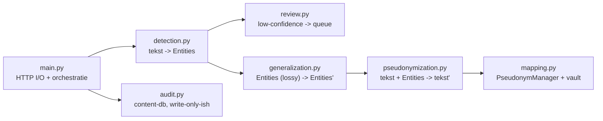
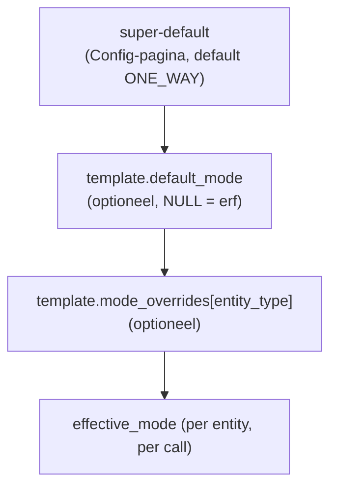

# Pylades — Architectuurplan (doel: v0.3)

> **Huidige release:** v0.3.0 (`shared/version.py`) · **Doelversie:** v0.3 (deze
> spec). Bron-spec en business rules: [SPEC-v0.3.md](SPEC-v0.3.md).
> **Status repo:** Stappen 1–17 geïmplementeerd (zie §19 en §20). Start met
> `uv run python scripts/pylades_services.py restart` (proxy `:8080`, UI `:8501`).

---

## 1. Wat we bouwen, in één paragraaf

Pylades is een lokale pseudonimiserende HTTPS-proxy (release **v0.3.0**,
richting doel **v0.3**) die op het pad `POST /v1/messages` een eigen
body-contract aanbiedt (zelfde pad als Anthropic, maar geen pass-through),
plus een Streamlit-beheer-UI. De proxy
detecteert gevoelige entities in elke prompt, generaliseert wat
generaliseerbaar is, vervangt de rest door HMAC-pseudoniemen, stuurt de
opgeschoonde prompt naar Anthropic en — *afhankelijk van de gekozen modus per
entity* — vertaalt de response weer terug. Scope is één gebruiker, één
machine, één LLM-provider; alles wat met multi-tenancy, encryptie-at-rest,
RBAC of compliance-flow te maken heeft, is bewust v1.0.

---

## 2. Procesarchitectuur: waarom twee processen en niet één

We draaien **twee aparte OS-processen** op `localhost`: de FastAPI-proxy op
`:8080` en de Streamlit-UI op `:8501`. Ze delen alleen state via de twee
SQLite-bestanden en het secrets-bestand op disk.

**Alternatieven afgewogen.**

- *Één FastAPI-proces dat ook HTML rendert.* Hiermee verliezen we Streamlit's
  one-shot dataframe-/widget-rendering die exact past bij het type "interne
  beheer-UI" dat we hier bouwen. We zouden zelf templating, livereload,
  formulieren en tabel-paginering moeten schrijven — uren werk voor geen
  inhoudelijke winst in v0.3.
- *Streamlit dat de proxy-logica intern aanroept.* Streamlit re-runt het hele
  script bij elke interactie; dat is incompatibel met een lang-levend
  proxy-proces dat HTTP-requests moet kunnen accepteren los van UI-acties.
  Bovendien zou de UI-process-crash dan ook de proxy mee onderuit halen.
- *Eén proces met threads voor proxy en UI.* Zelfde stabiliteits-probleem
  plus deelnametussen ASGI en Streamlit's eigen event-loop. Niet de moeite
  voor v0.3.

**Waarom apart wint.** Failure-isolation (UI-bug crasht de proxy niet en
omgekeerd), independent startup/shutdown (`uvicorn` en `streamlit` kunnen
ieder hun eigen reload-flow gebruiken), en — niet onbelangrijk — het maakt
het mentaal model klein: de UI is een *client* van de DBs, niet een
co-deelnemer in de request-flow.

**Consequentie van verkeerd trekken.** Als we proxy en UI samenvoegen,
verliezen we de mogelijkheid de proxy headless te draaien (CLI-gebruik vanuit
Cursor zonder UI), en wordt het lastig om in v1.0 de UI te vervangen door
iets anders (bv. een React-frontend op een REST-API) zonder de proxy te
raken.

**Communicatie tussen de twee processen.** Uitsluitend via de twee
SQLite-bestanden en het secrets-bestand. Geen sockets, geen message-queue,
geen shared memory. Reden: SQLite met WAL-mode geeft ons gratis een
single-writer/multi-reader-pattern dat voor deze schaal (één gebruiker)
ruimschoots voldoet, en houdt de operationele complexiteit op nul.

---

## 3. Datastore-architectuur: waarom twee SQLite-bestanden

BR-G02 schrijft scheiding voor; de vraag is *hoe* je die scheiding
implementeert. We kiezen voor **twee fysiek gescheiden SQLite-bestanden met
verschillende POSIX-permissies**, niet voor twee schema's in één bestand of
voor twee tabel-namespaces in één schema.

**Alternatieven afgewogen.**

- *Eén bestand, twee schema's via `ATTACH DATABASE`.* Technisch elegant maar
  ondermijnt het hele defensieve doel: één lekgevoelig `read_sqlite()`-pad
  kan beide schema's enumereren. De *file* is de blast-radius-grens, niet
  het schema.
- *Eén bestand, prefix-naming (`audit_*`, `vault_*`).* Naam-conventies zijn
  geen access-control. Een SELECT op `sqlite_master` lekt alles.
- *PostgreSQL met aparte rollen.* Geeft echte access-control, maar vereist
  een running server, gebruikersbeheer en backups. Voor één-machine-POC is
  dat operationeel overgewicht; v1.0 mag deze ruil opnieuw maken.
- *Twee databases in twee verschillende DBMS'en.* Absurd voor de schaal.

**Waarom twee files wint.** De security-claim is concreet en
inspecteerbaar: `ls -l pylades-vault.db` toont `0o600`; een proces zonder
owner-rechten kan het bestand niet eens openen. De code volgt het file-model:
`get_content_connection()` en `get_vault_connection()` zijn aparte functies
in [shared/db.py](shared/db.py), nooit te verwarren door type of naam.

**Consequentie van verkeerd trekken.** Een ontwikkelaar die per ongeluk
beide schema's in één file zet, vernietigt de hele BR-G02-garantie. Daarom
bouwen we vóór de logica een dedicated test (`tests/test_db_separation.py`)
die statisch verifieert dat `proxy/audit.py` uitsluitend de content-helper
importeert en `proxy/mapping.py` uitsluitend de vault-helper. Test-eerst is
hier geen TDD-religie maar regressie-bescherming op een onzichtbare grens.

**Waarom SQLite en niet Postgres.** Zero-ops, geen daemon, file-level
backup is `cp`, en file-permissies *zijn* een vorm van access-control die
past bij de "één gebruiker op één machine"-aanname. In v1.0 verschuift deze
ruil zodra meerdere gebruikers/processen tegelijk lezen en schrijven.

**Waarom geen ORM.** Twee redenen. (1) Het schema is klein (vijf tabellen
content + één tabel vault), en het bovenliggende risico is *kruisreferenties
tussen DBs*, niet boilerplate. Een ORM verstopt juist welke connection
gebruikt wordt achter een sessie-object. (2) ORMs als SQLAlchemy zijn
moeilijk te combineren met *twee* connection-pools die strikt niet mogen
mengen. Met `sqlite3` uit de stdlib zien we letterlijk in elke SQL-call welke
connection-helper er aangeroepen wordt — dat is precies de eigenschap die we
willen kunnen lezen tijdens code review.

**Waarom context managers, geen module-globale connection.** SQLite met
WAL-mode (die we standaard aanzetten voor betere lees-concurrency) verwacht
connection-affiniteit per thread; een gedeelde globale connection zou
silently bugs introduceren wanneer FastAPI's threadpool een handler op een
andere thread plant dan waarin de connection geopend werd. Context managers
maken levensduur expliciet en sluiten netjes bij exceptions.

---

## 4. Modulegrenzen in `proxy/` — waar lopen ze, waarom precies daar?

De proxy heeft zeven **kern**modules in de request-flow (zie diagram). Elk
hokje heeft één verantwoordelijkheid die niet samenvalt met de buren — wat
eruit gaat is het input-type voor het volgende. Daarnaast zijn er enkele
**hulpmodules** die later zijn toegevoegd: `templates.py` (template-CRUD op de
content-db), `deduce_layer.py` (laag 2: DEDUCE) en `name_spans.py` +
`role_names.py` (NL-naam/rol-heuristiek rond de DEDUCE-laag).



### Waarom `detection.py` en `generalization.py` apart

Detectie produceert *bevindingen* (waar staat wat); generalisering
*muteert* bevindingen en tekst (een `BIRTHDATE` wordt een `BIRTH_YEAR`).
Samen in één module zou twee niveaus van transformatie vermengen en het
debugging-pad verlengen: bij een onverwachte output is "is het niet
gedetecteerd" een wezenlijk andere bug dan "is het wel gedetecteerd maar
verkeerd gegeneraliseerd". Twee modules → twee unit-test-suites → twee
diagnose-paden.

**Consequentie van verkeerd trekken.** Als je generalisering in detectie
duwt, verlies je het vermogen om alleen detectie te draaien voor een
preview-modus in de UI (de gebruiker wil zien *wat* gedetecteerd is, vóór
elke lossy stap). Andersom: generalisering die zelf opnieuw zou moeten
detecteren, breekt het idempotency-principe.

### Waarom `pseudonymization.py` en `mapping.py` apart, en niet één module

`pseudonymization.py` doet **tekst-substitutie**: gegeven een set Entities en
een sessie, vervang in de tekst met pseudoniemen en lever de geschoonde
tekst. `mapping.py` doet **persistente state**: pseudoniem ↔ origineel
mappings naar de vault schrijven en weer terug lezen. De grens loopt op het
verschil tussen "puur-functioneel over een string" en "DB-zijeffect".

**Waarom dit ertoe doet.** `pseudonymize()` is daardoor unit-testbaar zonder
DB; je geeft een `PseudonymManager` met in-memory state mee en checkt de
output. Andersom kun je `PseudonymManager` testen los van text processing.
Als één module beide doet, ben je gedwongen alle pseudonimisering-tests met
DB-fixtures te draaien.

### Waarom `mapping.py` een **klasse** is en geen losse functies

`PseudonymManager` is een klasse omdat **per-sessie state** intrinsiek bij
deze module hoort: welke entities zijn al gezien, welk effectieve modus
heeft elk, en welke mappings staan nog in geheugen vóór `persist()`. Een
losse-functies-aanpak zou die state óf globaal moeten maken (kapot bij
parallelle sessies in v1.0, en nu al ongewenst voor isolatie tijdens tests)
óf het via expliciete parameters door de hele call-stack moeten reiken
(noise zonder winst).

**Vergelijking met het voorbeeld uit de spec.** Dit volgt exact het
patroon "*PlaceholderManager is een klasse omdat de counter-state binnen
sessie hoort, niet globaal*". Eén instance per request-lifecycle, kort
levend, expliciet vernietigbaar.

**Class-method `from_session(session_id)`.** Bewust géén `__init__`-overload
die optioneel een bestaande sessie herlaadt. Reden: twee paden ("nieuw" vs
"hervat") hebben verschillende invariants — bij hervat moet de vault al
mappings hebben — en die maak je duidelijker met een named alternative
constructor dan met if-statements in `__init__`.

### Waarom `review.py` apart van `detection.py`

De review-queue is *state* (persistent, met user-decisions), terwijl
`detection.py` *pure berekening* is. Het scheiden voorkomt dat
`detection.py` afhankelijk wordt van de content-DB — wat het cross-cutting
en moeilijk testbaar zou maken. `detection.py` retourneert daarom een
`DetectionResult` met `confident_entities` én `pending_review` (zie ook §6);
`proxy/main.py` beslist of `review.py.enqueue(...)` aangeroepen wordt.

### Waarom `audit.py` een eigen, smalle module is

`audit.py` heeft één externe regel die zwaarder weegt dan alle andere
ontwerpoverwegingen: **hij raakt de vault niet aan**. Door audit te isoleren
in zijn eigen file kun je in code review en in `tests/test_db_separation.py`
op file-niveau enforced controleren dat het scheidings-principe niet
weggesleten wordt door per ongeluk toegevoegde imports.

**Consequentie van verkeerd trekken.** Audit-logging mengen in `main.py` of
in `mapping.py` maakt de BR-G02-grens minder zichtbaar en — belangrijker —
moeilijker testbaar. Het verschil tussen "een lange functie waar ergens een
INSERT in mappings staat" en "een module die per definitie geen vault kent"
is precies wat de defense-in-depth-claim onderbouwt.

### Waarom `main.py` orchestratie maar geen logica

`proxy/main.py` is een dunne laag: HTTP I/O, header-parsing,
template-resolutie, en het aanroepen van de andere modules in volgorde. De
verleiding om "even snel" een regex of een DB-call hier neer te zetten is
groot; we weerstaan die omdat de orchestrator dan ondertestbaar wordt en
elk extra business-rule-vraagje moet weten welk endpoint er is.

---

## 5. Modulegrenzen in `shared/` — waarom drie + één

`shared/` bevat alles dat zowel proxy als UI nodig hebben. Vier modules:

- [shared/config.py](shared/config.py) — *single source of truth* voor
  alle environment-driven instellingen.
- [shared/models.py](shared/models.py) — Pydantic-modellen + Enums; het
  *vocabularium* van de hele applicatie.
- [shared/crypto.py](shared/crypto.py) — HMAC + checksum-validatoren;
  bewust geen DB en geen settings.
- [shared/db.py](shared/db.py) — connection-helpers en schema-init.

**Waarom `crypto.py` los van `db.py` of `mapping.py`.** Crypto-functies zijn
*puur* — input string → output string, geen I/O. Door ze in een eigen module
te zetten, zijn ze (a) triviaal te unit-testen zonder fixtures, (b)
herbruikbaar voor CLI-tooling of v1.0 zonder de DB-laag mee te slepen, en
(c) onafhankelijk te audit-en. De BR-C01-claim ("HMAC-SHA-256, geen plain
hash") wordt gerechtvaardigd door één klein bestand te lezen.

**Waarom `models.py` apart en niet ingebakken in elke gebruiker.** Het
vocabulaire — `EntityType`, `EntityCategory`, `PseudonymizationMode`,
`ReviewStatus` — moet *één* canonical bron hebben omdat het zowel in DB-
serialisatie (kolom-waardes), API-validatie (FastAPI request-body), als
UI-rendering (Streamlit dropdowns) opduikt. Drie kopieën van een Enum is een
recept voor sluipende inconsistentie.

**Consequentie van verkeerd trekken.** Als de UI z'n eigen `EntityType`-Enum
heeft, divergeren ze sluipsgewijs. Een type dat in DB op `BSN` staat maar in
UI als `BSN_NL` is bijvoorbeeld in een dropdown niet selecteerbaar — en
daarmee onreviewbaar in de review-queue.

---

## 6. Datastructuur-keuzes uitgelegd

### `EntityType` als `str`-`Enum`, niet als `Enum` of `Literal`

```python
class EntityType(str, Enum):
    BSN = "bsn"
    ...
```

**Waarom `str`-mix-in.** Pydantic v2 serialiseert `str`-Enum-waardes
transparant naar hun string-vorm, en SQLite slaat ze als TEXT op zonder
custom adapter. Een pure `Enum` zou bij elke DB-write een `.value`-cast
vereisen en bij Pydantic JSON-output een custom encoder; dat is werk dat we
niet hoeven te doen.

**Waarom geen `Literal["bsn","name",...]`.** Literals zijn niet itereerbaar,
geen runtime-instances, en kunnen geen method-attachments krijgen
(bijvoorbeeld een `display_name`). Een Enum is een eersteklas object dat we
later in de UI als bron voor dropdowns gebruiken.

### `EntityCategory` via een `dict`-mapping in plaats van een Enum-attribuut

```python
ENTITY_CATEGORY_MAP: dict[EntityType, EntityCategory] = { ... }
```

**Waarom een externe dict.** De categorie van een EntityType is *beleid* (en
varieert tussen v0.3 en v1.0), niet een intrinsieke eigenschap van het type.
Door de mapping als data in [shared/models.py](shared/models.py) te
houden, is BR-A01 één centrale tabel die we kunnen herzien zonder
Enum-definities te raken. Een Pydantic `model_validator` op `Entity` lijdt
de juiste `category` af tijdens construction, zodat de combinatie altijd
consistent is.

**Alternatief: een `category()`-method op `EntityType`.** Werkt, maar
verbergt de tabel in code en maakt review van BR-A01 lastiger (je moet door
een klasse-body bladeren in plaats van een tabel lezen).

### `Entity` als Pydantic-model, niet als dataclass of TypedDict

**Waarom Pydantic.** We hebben twee dingen die dataclasses niet leveren:
*runtime-validatie* (we krijgen entities binnen via API-headers of vanuit de
DB, en willen direct stoppen bij ongeldige waardes) en *derived fields*
(`category` afgeleid uit `entity_type` via `model_validator`). TypedDict
geeft type-checks zonder runtime-garantie — onvoldoende wanneer een externe
client of toekomstige Streamlit-formulier ons input voert.

**Waarom geen Pydantic voor *intern* gebruik en dataclass voor *DB-rows*.**
Twee model-schema's voor één concept is precies het soort divergentie dat
modellen-modules zouden moeten voorkomen.

### `DetectionResult` met **twee lists**, niet één list met een status-veld

```python
class DetectionResult(BaseModel):
    confident_entities: list[Entity]
    pending_review: list[Entity]
```

**Waarom twee lists.** De *consumer* (`proxy/main.py`) heeft twee
fundamenteel verschillende vervolgacties: bij `pending_review` niet leeg →
HTTP 423 terug. Eén lijst met een `Entity.status`-veld zou de consument
dwingen tot filter-aware code en zou subtle bugs verbergen wanneer iemand
het filter vergeet.

**Alternatief: `tuple[list[Entity], list[Entity]]`.** Bespaart één regel
code maar maakt call-sites onleesbaar (`result[0]` versus `result[1]`).

### `mode_overrides` als `dict[str,str]` in een JSON-kolom — *geen* aparte tabel

```sql
ALTER TABLE templates ADD COLUMN mode_overrides TEXT NOT NULL DEFAULT '{}';
```

**Waarom JSON-in-een-kolom.** Mode-overrides zijn (a) altijd samen met een
template gelezen — geen losse query-pad, (b) klein (~20 EntityTypes), en (c)
nooit *cross-template* geaggregeerd ("welke templates overruleren BSN?" is
een zeldzame UI-vraag, niet een proxy-hot-path). Een aparte
`template_mode_overrides`-tabel zou de schrijf-pad en lees-pad complexer
maken zonder een query-voordeel te leveren.

**Consequentie van verkeerd trekken.** Een echte tabel zou ons dwingen tot
JOIN's bij elke template-load (n+1 risk in de UI) en een tweede
schema-migratie als we ooit overrides per-EntityCategory willen toelaten.
JSON-kolom houdt die deur soepel open.

### `RARE_ICD10_CODES` als `set[str]`, niet `list[str]` of `frozenset[str]`

**Waarom `set`.** Membership-check is de enige operatie (`code in
RARE_ICD10_CODES`); set geeft O(1). List zou O(n) zijn — voor ~30 codes
verwaarloosbaar, maar het type *documenteert het gebruik*.

**Waarom geen `frozenset`.** Verschil is in v0.3 nul; `set` leest natuurlijker
en is geen winst om te bevriezen aangezien de constante module-level toch
niet opnieuw toegewezen wordt. We dragen geen voordeel; we sparen één
import.

### `global_secret` als `bytes`, niet `str` hex

**Waarom `bytes`.** `hmac.new()` accepteert `bytes` direct; werken met
hex-strings zou een `bytes.fromhex(...)`-stap toevoegen op een security-pad
waar elke transformatie een risico voor type-confusion is. De `secrets/`-file
bevat raw bytes (32) met mode `0o600` — geen hex, geen base64, niets om te
parsen.

### `session_id` als `str` (UUID4-hex), niet `uuid.UUID`

**Waarom `str`.** SQLite kent geen UUID-type, dus elke schrijfactie zou
serialiseren. Bovendien geven we de session_id als body-veld door naar
clients (`resume_session` — zie §15a) en in JSON-responses; daar is hij toch al
string.
Eén canonical representatie spaart een type-conversielaag.

---

## 7. Pseudonimiseringsmodi — waarom een drie-laagse resolver

De spec eist three-level override (super-default → template-default →
per-entity-override). Het centrale ontwerpinzicht is dat **modus per-entity
geëvalueerd wordt op het moment van pseudonimisering**, niet vooraf
samengevoegd in de template.



**Waarom resolve-on-the-fly, niet resolve-on-save.** Stel we *materialiseren*
de overrides bij template-save naar één veld `final_mode_per_type`. Dan
verandert een wijziging van de super-default niets aan oude templates totdat
elk handmatig opnieuw wordt opgeslagen — een gegarandeerd bron van
"waarom-gedraagt-deze-template-zich-niet-zoals-config"-bugs. De resolver
draait elke call, leest goedkoop uit content-db, en de waarheid leeft op één
plek.

**Waarom de UI de resulterende modus expliciet toont (derde kolom).** De
gebruiker is verantwoordelijk voor het BR-C06-besluit ("two_way vereist
documentatie waarom"); transparantie is de hele waarde-propositie. Zonder de
derde kolom moet de gebruiker mentaal de resolver draaien — dat is precies
het soort foutkans dat een privacy-gevoelige UI niet mag toelaten.

### Waarom de vault óók `ONE_WAY` mappings bewaart

Strikte lezing van BR-C06 zou kunnen suggereren dat one-way betekent: *geen
mapping bewaard*. We wijken bewust af, om twee redenen:

1. **BR-G01 (audit-trail) eist completeness.** Een audit-log met "hier stond
   ooit een naam die we niet meer kunnen reconstrueren" maakt incident-response
   onmogelijk en debugging frustrerend. De vault is de enige plek waar de
   originele waarde nog leeft (de prompt is in audit-log plaintext-bewaard;
   zie §10 voor de v0.3-beperking).
2. **One-way moet *gedrag* veranderen, niet *opslag*.** Door alleen de
   response-handling te veranderen behoudt ONE_WAY een doorzoekbare
   geschiedenis terwijl het netto-effect voor de externe LLM hetzelfde is:
   het origineel verlaat de machine niet, en het pseudoniem komt terug.

Dit is *expliciet* in [README.md](README.md) en zal in code-comments
herhaald worden op de plek waar het ertoe doet. v1.0 mag — met
HSM-sleutelbeheer — strikt-cryptografische one-way overwegen door bij
`ONE_WAY` enkel de hash op te slaan; in v0.3 zou dat audit-functionaliteit
schaden.

---

## 8. Detectiepijplijn — waarom drie cascading lagen

Drie lagen in vaste volgorde: **regex → DEDUCE → Ollama (optioneel)**. Elke laag heeft
een eigen *kost* (RAM, latency, gevoeligheid voor false positives) en eigen
*scope*.

**Waarom in deze volgorde.**

1. Regex is goedkoop, deterministisch en heeft *zeer hoge precisie* voor
   structureel-formele entities (BSN met elfproef, IBAN met mod-97, PC6,
   kenteken, MRN, EPD-id). Eerst regex draaien laat de duurdere lagen minder
   werk doen en garandeert dat een geldig BSN nooit door NER "gepromoveerd"
   wordt naar een free-text-naam.
2. DEDUCE levert NL-medische NER plus rol-heuristiek (`role_names`, `name_spans`)
   maar met lagere precisie op generieke namen/locaties; we accepteren lagere
   thresholds en routeren laag-confidence resultaten naar de review-queue.
   DEDUCE gebeurt *na* regex zodat het niet per ongeluk een "Jan de Vries
   123456782" als één persoon-entity ziet — de regex heeft het BSN al uit
   het oppervlak verwijderd.
3. Ollama is **default uit** omdat het ~1.4 GB extra RAM verbruikt en
   onstabiel kan zijn bij parallelle requests op een 8 GB-laptop. Wanneer aan,
   richt het zich op jargon en productnamen die regex en DEDUCE missen.

**Waarom losse laag-functies (`detect_regex`, `detect_deduce_with_status`,
`detect_llm_with_status`) en pas in `detect_all()` gecomponeerd.** Test-isolatie.
Een regex-faal mag niet wachten op DEDUCE-init; Ollama-tests mogen niet falen
omdat DEDUCE niet beschikbaar is. Door iedere laag los testbaar te maken,
zijn `tests/test_detection.py`-runs snel en hebben we vrijheid om in CI
selectief lagen te skippen.

**Waarom `detect_llm` *soft-fails*.** Ollama-timeouts of JSON-parse-errors
mogen de hele detectie niet stoppen; de andere lagen hebben hun werk al
gedaan. Het alternatief — exception laten doorpropageren — maakt het hele
proxy-pad afhankelijk van een optionele subsysteem. We loggen een warning en
retourneren een lege lijst.

**Consequentie van verkeerd trekken.** Als we lagen sequentieel laten
*verrijken* in plaats van *cascaderen* (bijvoorbeeld: laag 2 mag regex-matches
overschrijven), verliezen we de hoge-precisie-garantie van laag 1. De rule
is: latere lagen mogen *toevoegen*, niet *overschrijven*; overlap-resolutie
in `detect_all()` kiest de eerdere laag bij conflict.

### Waarom de review-queue HTTP 423 Locked retourneert

**Waarom 423 en niet 400/409/202.** Een 4xx is correct omdat de client iets
moet doen; een 5xx zou suggereren dat de server stuk is. 423 ("Locked") is
semantisch het dichtste bij "deze sessie is geblokkeerd in afwachting van
een handmatige beslissing". 400 zou wijzen op malformed input; 409 op een
versie-conflict; 202 op een achtergrondtaak waarvan we het resultaat later
pollen — niet wat hier gebeurt. De client krijgt `{session_id, review_url}`
zodat het hervat-pad (body-veld `resume_session: <id>` — zie §15a)
klaarstaat.

---

## 9. Generalisering — waarom *lossy* een feature is, geen bug

De generalisering-stap is opzettelijk informatie-vernietigend: een
geboortedatum wordt een geboortejaar, een PC6 wordt een PC2, een leeftijd
boven 90 wordt "90+". Dat is precies wat BR-B vraagt: minimaliseer de
informatie die de externe LLM ziet.

**Waarom dit niet "gewoon pseudonimiseren" is.** Pseudonimiseren vervangt
ene token door een onleesbare token, maar bewaart een 1-op-1 relatie. Een
LLM die ziet "patiënt geboren `[BDT-9a3f12]`" kan op de leeftijd niets
inferren; een LLM die ziet "patiënt geboren in 1956" *kan* dat — en dat is
hier vaak gewenst (het LLM-antwoord wordt klinisch zinvoller). De keuze
tussen pseudonimisering en generalisering per entity-type is een
*bruikbaarheid-vs-privacy*-knop: BR-B trekt die knop voor specifieke types.

**Waarom de vault desondanks het origineel bewaart.** Zonder origineel is
audit en review onmogelijk; zonder generalized-vorm zou de UI niet kunnen
laten zien wát er weggegeven is. De `mappings`-tabel bewaart beide. In de
`Entity` houden we `original`, `generalized_to: str | None`, en het
type-veranderpad (`BIRTHDATE` → `BIRTH_YEAR`).

**Waarom generalisering vóór pseudonimisering.** Twee redenen: (a) wat
gegeneraliseerd is, hoeft niet meer gepseudonimiseerd (jaartallen zijn geen
direct-identifier); (b) het type kan veranderen, en het pseudoniem-prefix
hangt af van het *uiteindelijke* type (anders krijgen we `[BDT-...]` voor wat
inmiddels een jaar is — verwarrend).

---

## 10. Audit- en vault-schema's — keuzes per kolom

### `audit_log.original_prompt` als TEXT, plaintext (v0.3-beperking)

We slaan de originele prompt **plaintext** op in `pylades-content.db`. Dit is
de bewuste, gedocumenteerde v0.3-beperking:
[README.md](README.md) waarschuwt erover, en de overall claim is dat BR-G02
ons beschermt tegen *runtime-exfiltratie* (netwerk, provider-logs,
geïntercepteerde responses), niet tegen diefstal van de audit-DB-file. v1.0
vervangt dit door óf encrypt-at-rest, óf een hash + bewijs-van-integriteit
zonder inhoud.

**Waarom zo expliciet documenteren.** Een security-claim die ongedocumenteerd
sterker klinkt dan hij is, is gevaarlijker dan een eerlijk gedeclareerde
beperking. Het hoort verplicht in README per BR.

### `mappings` met `UNIQUE(session_id, pseudonym)` én `UNIQUE(session_id, original, entity_type)`

**Waarom twee unique constraints.** De eerste voorkomt collisions in de
6-hex-character pseudoniem-ruimte binnen één sessie (zie risico-register).
De tweede voorkomt dubbele entries voor hetzelfde origineel-per-type — twee
inserts van dezelfde "Jan" als `NAME` in één sessie moeten één mapping zijn,
niet twee. Het `entity_type` zit bewust in de sleutel: alleen wanneer hetzelfde
oppervlak terugkomt als een *ander* type ontstaat een aparte rij (en dus een
apart pseudoniem-prefix).

**Consequentie van weglaten.** Zonder de tweede constraint bouwen we
sluipsgewijs een N-op-1-relatie waar de code een 1-op-1 verwacht; bij
`deanonymize()` weet je niet meer welke "Jan"-record bedoeld is.

### `pseudonymization_mode` op de **mapping-rij**, niet op de template

**Waarom op de mapping.** De effectieve modus is een runtime-eigenschap van
de specifieke entity-in-deze-sessie, niet van de template. Twee redenen: (a)
dezelfde entity-type kan in twee sessies een andere mode hebben als de
template-config tussen sessies is aangepast; we willen de historische
"hoe gingen we ermee om" bewaren. (b) `depseudonymize()` heeft per-pseudoniem
de modus nodig; opzoeken via template-ID + entity-type zou een join over
twee DBs vereisen, wat we expliciet verboden hebben.

### Geen vreemde sleutel tussen `audit_log` en `mappings`

**Waarom geen FK.** Vreemde sleutels tussen twee SQLite-bestanden kúnnen
niet (geen ATTACH = geen referentiële integriteit), en *willen* we niet —
het zou een lees-pad introduceren dat content en vault mixt, wat BR-G02
ondergraaft. De koppeling is `session_id` als gedeelde *logische* sleutel,
gegarandeerd door de applicatielaag.

---

## 11. Concurrency en async — waarom waar wel en waar niet

**Async waar het hoort.** `proxy/main.py` is FastAPI-handler-niveau async,
en de Anthropic-call gebeurt via `httpx.AsyncClient`. Dat is winst omdat één
worker meerdere langlopende API-calls tegelijk aankan zonder thread-druk.

**Sync waar het meer waard is.** Detectie, generalisering, pseudonimisering
en alle DB-toegang zijn sync. DEDUCE draait sync; HMAC is CPU-werk dat niet
profiteert van async;
SQLite via `sqlite3` is sync. Sync code is leesbaarder en sneller te
debuggen voor de bulk van de pijplijn.

**Waarom geen `aiosqlite`.** Onze schaal (één gebruiker, ~milliseconden per
query) maakt de async-winst nul terwijl de complexiteit groeit. Bovendien
mixt het slecht met onze keus voor expliciete context-managers en
per-thread-affiniteit.

**Threadpool-grootte.** Standaard `uvicorn`-defaults; we tunen pas als
profiling het vraagt.

---

## 12. Error handling — drie soorten fouten, drie reacties

We classificeren elke fout in één van drie buckets, en de respons-strategie
volgt automatisch:

1. **Configuratie-fout** (API-key ontbreekt, settings invalid). Fail-fast bij
   startup met een duidelijke message. Pydantic-settings doet dit gratis;
   we proberen niet "soft te degraderen".
2. **Optionele subsysteem-fout** (Ollama down, DEDUCE-init faalt). Soft-fail
   met logged warning; vervolg met de overige lagen. De gebruiker hoort dit
   eenmaal te zien op de Streamlit-statuspagina.
3. **Request-fout** (malformed body, entity onder threshold, provider niet
   anthropic). Vertaalt naar specifieke HTTP-status: 400, 423, 501.

**Geen bare `except`.** Elke `except` benoemt de exception-klasse expliciet
zodat bugs niet in stilte verdwijnen. `logging` per module met
`logger = logging.getLogger(__name__)`; geen `print()`.

---

## 13. Test-strategie — wat bewijs je waar, en waarom

### `tests/test_db_separation.py` — eerst, en statisch

**Waarom als eerste test.** Het bewaakt de BR-G02-claim die elders niet
inspectabel is in code zonder de hele applicatie te begrijpen. Door deze
test te bouwen *vóór* de logica, voorkomen we dat een vroege import-fout
sluipsgewijs onderdeel wordt van een werkende build.

**Hoe.** AST-parsing van `proxy/audit.py` en `proxy/mapping.py`: faal als
`audit.py` `get_vault_connection` importeert of als `mapping.py`
`get_content_connection` aanroept. Geen runtime-magic; deterministisch.

### Unit-tests met fixtures voor BSN/IBAN/etc.

**Waarom positieve én negatieve fixtures.** Een test die alleen geldige
input voert toont niet dat de checksum-validatie ook iets afkeurt. Vandaar
in [data/fixtures.py](data/fixtures.py): geldig BSN `123456782` (passeert
elfproef) en ongeldig `123456789` (faalt), met expliciete assertions in
beide richtingen.

### Integratietest met `httpx.MockTransport`

**Waarom geen echte Anthropic-call in tests.** Drie redenen: kosten, niet-
determinisme, en netwerk-afhankelijkheid in CI. `httpx.MockTransport` laat
ons een nep-Anthropic injecteren die exact dezelfde wire-format teruggeeft;
de pseudonimisering- en de-pseudonimisering-paden zijn testbaar zonder een
key.

### Geen UI-end-to-end-tests in v0.3

**Waarom niet.** Streamlit-testing is fragiel en duur; de UI is een dunne
laag boven de business-logica die wél unit-getest is. We accepteren
handmatige acceptance-criteria voor de UI in plaats van een test-pyramide
die voor één-gebruiker-POC overdreven zou zijn.

---

## 14. Bouwvolgorde — waarom in deze volgorde


**Waarom shared/ vóór proxy/.** Iedereen importeert shared; als die scheuren
heeft, multipliceren ze door alle downstream-modules.

**Waarom db.py + separation-test op stap 3.** Zie §13 — eerst de
onzichtbare grens bewijzen, dan de logica eromheen.

**Waarom fixtures vóór detection.** Test-driven detection zonder fixtures is
het uitvinden van regex op stack-traces; mét fixtures schrijf je
unit-tests die de regex *vasthouden* aan een verwachting.

**Waarom detection vóór generalization.** Generalization neemt
`list[Entity]` als input — een type dat detection produceert. Pas als
detection's contract vast staat, kan generalization erop bouwen.

**Waarom pseudonymization + mapping in één stap.** Beide modules zijn pas
zinvol samen; mapping bestaat als persistentie-laag voor pseudonymization.
Tests draaien per module, maar het paar wordt als één commit opgeleverd.

**Waarom main.py op stap 10, niet eerder.** Een proxy die niet kan
detecteren, generaliseren of pseudonimiseren is een echo-server. Pas als de
onderliggende lagen werken, bouwen we de HTTP-schil eromheen.

**Waarom UI als laatste.** UI is consumer van alles; het hoeft niets voor te
financieren. Templates eerst (CRUD vóór gebruik), Config tweede (omdat
testruns config nodig hebben), Review Queue derde (omdat testruns
review-blocks kunnen produceren), Testruns vierde, Audit vijfde.

---

## 15. Risico-register — concrete risico's met mitigatie

- **8 GB RAM-druk** bij gelijktijdig Ollama + DEDUCE + Streamlit + IDE →
  laag 3 default uit; documentatie raadt Ollama tijdelijk stoppen aan tijdens
  zware sessies. spaCy zit alleen in `--extra eval` (modelvergelijking).
- **Pseudoniem-collisions in 6 hex chars** (~16.7M ruimte per sessie) →
  binnen één sessie verwaarloosbaar; de `UNIQUE(session_id, pseudonym)`
  constraint detecteert het hoe-dan-ook bij INSERT en logt de fout.
- **Partial-match bij `depseudonymize`** (bijv. `[BSN-abc123]` als prefix van
  `[BSN-abc1234]`, die in deze format niet voorkomt maar in v1.0 zou kunnen)
  → vervangen in volgorde van langste-pseudoniem-eerst.
- **Stille kruislingse DB-import** → AST-test op stap 3.
- **Plaintext `original_prompt`** in audit-log → expliciet in README;
  v1.0-pad gedefinieerd.
- **Ollama-instabiliteit** → soft-fail; warning in log; UI status-card toont
  rode indicator bij downtime.
- **HMAC-sleutel verlies of accidentele rotatie** → archiveer-kopie naar
  `secrets/global_secret.bin.archived-<ts>`; verplichte CSV-export-checkpoint
  vóór rotatie; typed-confirmation `ROTEER` als final guard.
- **Streamlit re-runs verstoren proxy** → processen scheiden (zie §2).
- **Provider-key in `.env` per ongeluk gecommit** → `.env` in
  [.gitignore](.gitignore); `.env.example` ontbreekt API-key-waarde.

---

## 15a. v0.3-oplevering — Opdracht-template één-placeholder + body-API

> Status: **geïmplementeerd** (stap 17, zie §20). **Nog open voor de v0.3-vlag:**
> uitvoerige praktijktests met de eerste drie beproefde use cases (zie §19).
> Deze sectie beschrijft het definitieve `POST /v1/messages`-contract (eigen
> body-shape, verplichte `template_id`, één `{input}`-placeholder).

### Concept

Een prompt-template bevat **uitsluitend de LLM-opdracht** plus **exact één
placeholder `{input}`** voor de patiëntdossier-tekst. Templates bevatten zelf
nooit PII; de variabele input wordt op de Testruns-pagina apart ingeplakt en
door de proxy server-side gesubstitueerd. Voorbeeld:

```text
Vat het volgende patiëntdossier samen in maximaal 5 bullets.
Markeer rode vlaggen.

Dossier:
{input}
```

### Waarom dit ontwerp

- **Templates blijven herbruikbaar over dossiers** en zijn vrij van PII —
  handig voor versionering, CSV-export en code-review.
- **One source of truth voor de opdracht.** De instructie staat in de DB; de
  client kan hem niet stilletjes wijzigen vóór POST.
- **Audit is eenduidig.** `original_prompt` = volledig samengestelde prompt
  (instructie + dossier); de instructie blijft via `template_id`
  reconstrueerbaar.
- **API-contract wordt klein en zelf-verklarend.** Eén body-shape, geen
  verborgen functionele headers.

### Datamodel — `shared/models.py::Template`

- Nieuw verplicht veld **`max_tokens: int`** (default 16 000, validator `> 0`).
  Verplaatst uit de API-body; één bron-van-waarheid per template.
- Nieuw veld **`use_llm: bool`** (default `False`): schakelt detectielaag 3
  (Ollama) per template in; proxy en Testruns-dry-run respecteren
  `template.use_llm` bij `detect_all(...)`.
- Validator op `prompt_tekst`:
  - Lege string blijft toegestaan voor edge-cases (technische default tijdens
    migratie en voor seed-rijen die later worden voltooid).
  - Niet-lege waarde moet **exact één** voorkomen van `{input}` bevatten;
    andere `{naam}`-placeholders → ValidationError (anders worden ze
    stilzwijgend doorgegeven aan het LLM).

### DB-schema — tabel `templates`

- Kolommen `max_tokens INTEGER NOT NULL DEFAULT 16000` en
  `use_llm INTEGER NOT NULL DEFAULT 0` via idempotente ALTERs in
  `init_databases()` (bestaande rijen: 16 000 tokens, LLM-laag uit).

### API-contract `POST /v1/messages`

Eigen body-shape, niet meer Anthropic-pass-through:

```json
{
  "template_id": 1,
  "dossier": "<patiëntdossier-tekst>",
  "resume_session": null
}
```

- **`template_id`** — verplicht (`int`).
- **`dossier`** — verplicht, niet-leeg (`str`).
- **`resume_session`** — optioneel (`str | None`), vervangt header
  `X-Pylades-Resume-Session`.
- `model`, `provider`, `max_tokens` komen uitsluitend uit de template (één
  bron-van-waarheid).
- Geen `system`, geen `messages`, geen `X-Pylades-Template-Id`/
  `X-Pylades-Resume-Session` headers.

**Waarom body i.p.v. header voor `resume_session`.** Het is functionele input
voor de pijplijn (bepaalt of detectie-merge wordt uitgevoerd), niet
puur-operationele metadata. Eén consistent Pydantic-body-model is ook netter
dan een mix van body + `Header(...)`-parameters.

### Foutpaden

| Conditie | Status |
|---|---|
| Body-JSON kapot | 422 (Pydantic/JSON-decode) |
| `template_id` / `dossier` ontbreekt of leeg | 422 (Pydantic) |
| `template_id` niet in DB | 404 |
| Template-`prompt_tekst` leeg of zonder `{input}` | 500 (DB-validator hoort dit te voorkomen) |
| `template.llm_provider != "anthropic"` | 501 |

### Server-side flow (`proxy/main.py`)

1. Parse body → Pydantic `MessagesRequest`.
2. Laad template; check provider.
3. Sessie-id: `resume_session or uuid4().hex`.
4. **Stel prompt samen**: `assembled = template.prompt_tekst.replace("{input}", dossier)`.
5. Detect → review-poort → generalize → pseudonymize op `assembled` — de
   instructie-tekst is per design PII-vrij dus geen false positives.
6. Bouw Anthropic-body op:
   `{"model": template.llm_naam, "max_tokens": template.max_tokens, "messages": [{"role": "user", "content": <pseudonimized>}]}`.
7. Upstream → de-pseudonimize response → audit → return.

### Vervallen onderdelen

- `default_template()` in [proxy/templates.py](proxy/templates.py) — template
  is verplichte API-parameter, geen fallback meer.
- Headers `X-Pylades-Template-Id` en `X-Pylades-Resume-Session`.
- Multi-veld text-scan (`_collect_text_fields`, `_set_text_field`,
  `_read_text_field`) — er is nog maar één tekst (`assembled`).
- `extract_placeholders` / `fill_placeholders` in
  [ui/testrun_helpers.py](ui/testrun_helpers.py) → vervangen door één
  `fill_input(template, dossier)`-helper.

### UI

- **Opdrachten-pagina** (`ui/views/2_Opdrachten.py`, voorheen "Templates"): numeriek veld
  **Max tokens** (default 16 000), toggle **Ollama-detectie (laag 3)** voor
  `use_llm`. Caption + validator-feedback verwijzen naar verplichte `{input}`.
- **Testrun-flow op Home** (`ui/Home.py` + `ui/views/0_Home.py`, voorheen een
  aparte "Testruns"-pagina): template-selector +
  **één tekstvak "Patiëntdossier"**; extra-context-veld en placeholder-
  inputs vervallen. Verstuur-knop POST't `{template_id, dossier, resume_session}`.
  Analyse-preview met kleurmarkering (ONE_WAY/TWO_WAY/pending); dossier en
  hervat-sessie in `st.session_state` (navigatie tussen pagina's).
- **Review-queue-pagina** (`ui/views/3_Review_Queue.py`): hervat-paneel toont
  het body-veld `resume_session: <id>` in plaats van de oude header.
- **UI-shell** (alle entry-pagina's via `init_pylades_ui()` in
  [ui/ui_extras.py](ui/ui_extras.py)): donker theme
  ([.streamlit/config.toml](.streamlit/config.toml)), CSS-polish
  ([ui/theme.py](ui/theme.py)), metric-cards via `streamlit-extras`.
  **Logo** `ui/assets/logo.png` (205×220, gecentreerd boven sidebar-menu via
  `st.logo` + CSS op `stSidebarLogo`). **Favicon** `ui/assets/favicon.png` —
  tabblad via Streamlit-static (`[ui/favicon_sync.py](ui/favicon_sync.py)`,
  aangeroepen bij `scripts/pylades_services.py restart`).

### Audit

- `original_prompt` = volledig samengestelde prompt (instructie + dossier);
  zelfde kolom-shape als nu.
- `pseudonymized_prompt` = pseudonimized variant.
- `template_id` blijft kolom; instructie is via template reconstrueerbaar.
- Geen extra kolom voor "dossier-only" — die duplicatie levert geen
  audit-functionaliteit op die niet al via `template_id`-join verkrijgbaar is.

### Migratie

- DB: ALTER voor `max_tokens` is idempotent en geeft bestaande rijen
  `DEFAULT 16000`. Geen handmatige stap.
- **Geen** geforceerde data-migratie van bestaande templates. Bij eerste
  editor-save dwingt de validator `{input}` af.
- [data/fixtures.py](data/fixtures.py) blijft inhoudelijk gelijk; de
  fixture-prompts worden voortaan beschouwd als *dossier-snippets* die je in
  het Patiëntdossier-veld plakt. Alleen een docstring-zin wordt verhelderd.

### Test-impact

- [tests/test_proxy.py](tests/test_proxy.py) — request-bodies herschreven
  naar `{template_id, dossier}`-vorm; nieuwe cases voor 422 (ontbrekend veld),
  404 (onbekend template), resume via body-veld.
- [tests/test_templates_crud.py](tests/test_templates_crud.py) — validator-
  tests voor `prompt_tekst` met 0 / 1 / >1 voorkomens van `{input}` plus een
  `max_tokens`-roundtrip.
- [tests/test_testrun_helpers.py](tests/test_testrun_helpers.py) —
  `extract/fill_placeholders`-tests vervangen door `fill_input`-tests;
  `_basic_template().prompt_tekst` → `"Vat samen: {input}"`.
- [tests/test_pseudonymization.py](tests/test_pseudonymization.py) —
  ongewijzigd (lege `prompt_tekst` blijft toegestaan voor `_minimal_template`).

### Documentatie

- [DEMO.md](DEMO.md) — `curl`-voorbeelden + template-prompts herschrijven
  naar het nieuwe contract met `{input}`.
- [README.md](README.md) — nieuwe `/v1/messages` body-shape; resume-flow als
  body-veld.

### Buiten scope (ongewijzigd)

Detectie/generalisatie/pseudonimisering intern; review-queue-logica; vault,
mappings, key-rotatie; Anthropic-only restrictie (501); streaming (v1.0).

---

## 16. v1.0 roadmap — waarom uitgesteld, niet "later"

Elk uitgesteld item heeft een motivering die uitlegt waarom we het *nu* niet
doen, niet alleen dat we het later doen.

- **Multi-tenancy** — vereist authenticatie, autorisatie, per-user
  cryptografische sleutels en data-isolatie op DB-niveau. Eén-gebruiker-POC
  zou alle vier moeten *en* mogen niet doen om scope te halen.
- **Encryptie-at-rest** — hangt af van een sleutelbeheermodel (HSM of
  password-KDF). Zonder dat raad je in welke richting je migreert.
- **Provider-agnostiek** — vereist een adapter-laag die nu niet betaalt: één
  provider = geen abstractie. We willen niet de "premature abstraction"-fout
  maken; v1.0 introduceert de adapter wanneer een tweede provider gevraagd
  wordt.
- **Streaming responses** — Anthropic ondersteunt het, maar het breekt het
  audit-model (volledige response in DB-rij) en de
  de-pseudonimisering-strategie (we vervangen na compleet ontvangen).
  Streaming herontwerpt audit als append-only met chunks; uit scope.
- **TLS 1.3 + mTLS** — localhost-proxy heeft geen netwerk-blootstelling;
  TLS-overhead in v0.3 zonder dreigingsmodel is theater.
- **Medisch NER + k-anonimiteit + l-diversity** — vereist datasets en
  validatie-werk dat een POC niet kan dragen.
- **HSM-sleutelbeheer** — vereist hardware/clouddienst; v0.3 gebruikt een
  bestand met `0o600` als realistisch maar duidelijk niet productie-rijp
  alternatief.
- **Tamper-evident audit-log** — vereist append-only architectuur (Merkle
  chains of WORM-storage). Klein op de roadmap, groot in implementatie.
- **DPIA/FG-goedkeuringsflow** — proces, geen code; hoort bij eerste echte
  use-case.

---

## 17. Wat NIET — en de redenering achter elke "nee"

- **Geen Docker.** Eén user, één machine, één terminal-set. Docker zou een
  laag toevoegen zonder Ops-baat in v0.3.
- **Geen auth op UI.** Localhost-binding + file-permissies zijn de
  access-controle; auth zou suggereren dat de UI veilig over een netwerk
  bereikbaar is, wat *niet* zo is.
- **Geen at-rest encryptie.** Zie §16 — vereist sleutelbeheer-model.
- **Geen streaming.** Zie §16.
- **Geen ORM.** Zie §3.
- **Geen LangChain/LlamaIndex.** We doen geen RAG, geen
  agent-orchestration; deze libraries lossen problemen op die we niet hebben.
- **Geen unsalted hash, MD5 of SHA-1.** Cryptografisch achterhaald, en
  BR-C01 verbiedt het expliciet. HMAC-SHA-256 is non-negotiable.
- **Geen kruisreferenties content↔vault buiten `session_id`.** Zie §10.
- **Geen provider-abstractie.** Anthropic-only in v0.3; abstractie bouw je
  bij de *tweede* concrete implementatie, niet bij de eerste.
- **Geen `# TODO` zonder concreet vervolg.** Elke TODO heeft een eigenaar of
  een v1.0-referentie.

---

## 18. Tooling en stijl — waarom deze afspraken

- **`uv` als package-manager.** ~10-100x sneller dan Poetry/pip, geen extra
  globale install nodig (single binary), en lock-file in git voor
  reproduceerbaarheid. Voor één developer is dit pure ergonomie-winst.
- **`ruff` als linter + formatter.** Eén tool die isort, black en pylint-
  subset combineert. Snel, geen plugin-zoo.
- **`mypy` strict alleen voor `shared/` + `proxy/`.** Streamlit-pagina's
  zijn top-level scripts met dynamisch geladen `st.session_state`; strict
  type-checken daar is een gevecht met de framework. De *kritieke* code is
  shared en proxy; daar telt elke `Optional` en elke return-type.
- **Line-length 100.** Compromise tussen Pythonic 88 en de leesbaarheid van
  langere regex-/SQL-strings die we hier veel hebben.
- **Docstrings NL, inline comments alleen waar de logica niet voor zichzelf
  spreekt.** Projectconventie uit SPEC-v0.3; voorkomt comment-rot.
- **`logging` per module, geen `print`.** Stelt UI-status-cards in staat
  per-module verbose-instellingen aan/uit te zetten.
- **Releaseversie centraliseren.** `shared/version.py` (`__version__`) +
  sync met `pyproject.toml`; UI/API via `pylades_display()` e.d. Versieregel
  `.cursor/rules/versioning.mdc`: versievoorstel vóór elke commit.

---

## 19. Status nu, eerstvolgende stap

**Stappen 1–17 (klaar).** Release **v0.3.0** — scaffold, `shared/`, DB-laag, testdata, volledige
proxy-pijplijn, alle UI-pagina's, het v0.3 API-contract (§15a) en UI-shell
(logo/favicon, theme). **403 tests** groen (canonieke teststand voor dit document).
`uv run pytest`, `uv run ruff check .`
en mypy op `shared/` + `proxy/` zijn schoon. Services:
`uv run python scripts/pylades_services.py restart`.

**Volgende — v0.3-oplevering (praktijk).** Uitvoerige praktijktests op een verse DB
plus de **eerste drie beproefde use cases** end-to-end vastleggen (zowel
het happy-path als de review-flow en mixed ONE_WAY/TWO_WAY); deze drie
bouwen voort op de demoscenario's in [DEMO.md](DEMO.md) en worden de
acceptatie-bewijslast voor de v0.3-vlag.

---

## 20. Bouwstappen-checklist

Levende voortgangs-tracker. Vink af zodra de stap is opgeleverd plus
`uv run pytest tests/ -v` en `uv run ruff check .` groen zijn. Voor de
motivering waarom de stappen *in deze volgorde* staan, zie §14.

### Foundation

- [x] **Stap 1 — Scaffold.**
  [pyproject.toml](pyproject.toml), [.env.example](.env.example),
  [.gitignore](.gitignore), [README.md](README.md) (productie-disclaimer +
  bekende v0.3-beperking letterlijk in eigen kop-secties).
  *Klaar wanneer:* `uv sync --extra dev` slaagt, `uv run ruff check .`
  groen, alle core-imports werken.

- [x] **Stap 2 — `shared/`-basismodules (geen I/O).**
  [shared/config.py](shared/config.py) (pydantic-settings, één singleton
  `settings`), [shared/models.py](shared/models.py) (Enums + Pydantic v2
  modellen + `ENTITY_CATEGORY_MAP` + `SHORT_TYPE_CODES`),
  [shared/crypto.py](shared/crypto.py) (HMAC + BSN-elfproef + IBAN mod-97).
  *Klaar wanneer:* `python -c "from shared import config, models, crypto"`
  slaagt; mypy strict clean op `shared/`.

- [x] **Stap 3 — DB-laag + scheidings-test eerst.**
  [shared/db.py](shared/db.py) (twee connection-helpers met
  commit/rollback-context-managers, idempotente `init_databases()`,
  config-upsert-helpers, schema's), [tests/test_db_separation.py](tests/test_db_separation.py)
  (AST-check + runtime-invariants). De AST-bewakers skippen tot
  `proxy/audit.py` en `proxy/mapping.py` bestaan; de runtime-invariants
  lopen meteen.
  *Klaar wanneer:* twee `.db`-files aangemaakt; vault is `0o600`;
  separation-test 6 passed + 2 skipped (skips genoemd naar stap 7/9).

- [x] **Stap 4 — Testdata.**
  [data/fixtures.py](data/fixtures.py) (8 NL-scenario's met BSN/IBAN/PC6/
  MRN/EPD/ICD/contactgegevens-dekking, plus import-time consistency-check
  tegen `validate_bsn_elfproef`, `validate_iban_checksum` en
  `RARE_ICD10_CODES`), [data/icd10_rare.py](data/icd10_rare.py)
  (29 codes met import-time ICD-10-format-check).
  *Klaar wanneer:* fixtures importeerbaar; constants kloppen met crypto-
  validators; `RARE_ICD10_CODES` heeft alle codes die fixtures noemen.

### Proxy-pijplijn

- [x] **Stap 5 — Detectie.**
  [proxy/detection.py](proxy/detection.py) (regex + DEDUCE + Ollama
  soft-fail + threshold-routing) + [tests/test_detection.py](tests/test_detection.py).
  *Klaar:* 12 regex-patronen + 3 context-date-patronen (ADMISSION/DISCHARGE/
  EXAM); BSN-elfproef en IBAN-mod-97 wijzen ongeldige matches af; DEDUCE
  als enige runtime laag 2 (`proxy/deduce_layer.py`, soft-fail bij init);
  Ollama achter `use_llm=True` met brede exception-vangst; `Thresholds`
  routeren naar `confident_entities` of `pending_review`; regex wint bij
  cross-layer-overlap.

- [x] **Stap 6 — Generalisering.**
  [proxy/generalization.py](proxy/generalization.py) (BR-B01..B05 met
  orkestrator + per-regel config-toggles) + [tests/test_generalization.py](tests/test_generalization.py).
  *Klaar:* BIRTHDATE→BIRTH_YEAR; PC6→PC2; leeftijd ≥90→`90+ jaar`/`90+ jarige`;
  ADMISSION/DISCHARGE/EXAM: `op <datum>`→` in YYYY-MM`; zeldzame ICD-10 via
  `Entity.rare_icd_review`; `GeneralizationConfig`/`from_db()` keys
  `gen_*`; `generalize_all`/`apply_generalizations` keten; span-projectie
  na elke substring-vervanging. 72 tests totaal (4 skips ongewijzigd).

- [x] **Stap 7 — Pseudonimisering + mapping.**
  [proxy/pseudonymization.py](proxy/pseudonymization.py) +
  [proxy/mapping.py](proxy/mapping.py) (`PseudonymManager`) +
  [tests/test_pseudonymization.py](tests/test_pseudonymization.py) + [tests/test_mapping.py](tests/test_mapping.py).
  *Klaar:* `resolve_effective_mode` + `get_super_default_pseudonymization_mode` (config-key
  `super_default_pseudonymization_mode`); `pseudonymize` / `depseudonymize`; vault
  `UNIQUE(session_id, original, entity_type)`; langste pseudoniem eerst bij
  terugvertaling. 83 tests (3 skips: audit + spaCy).

- [x] **Stap 8 — Review-queue.**
  [proxy/review.py](proxy/review.py) (`enqueue` / `get_pending` / `decide` /
  `all_resolved` / `get_accepted_entities` / `get_item`) +
  [tests/test_review.py](tests/test_review.py).
  *Klaar:* `enqueue` doet `INSERT OR IGNORE` op `sessions` voor de FK;
  `decide` blokkeert terug-naar-PENDING en eist `modified_type` bij
  MODIFIED; `all_resolved` is True bij 0 pending of lege queue;
  `get_accepted_entities` levert ACCEPTED + MODIFIED terug voor de
  resume-flow (rejected vallen weg). 94 tests groen (3 skips:
  audit + spaCy).

- [x] **Stap 9 — Audit.**
  [proxy/audit.py](proxy/audit.py) (`log_request` keyword-only,
  `get_recent_logs` met limit-clamp, `get_log_by_id`, `get_logs_by_session`)
  + [tests/test_audit.py](tests/test_audit.py).
  *Klaar:* `AuditEntry` toegevoegd aan `shared/models.py`; alleen
  `get_content_connection`; AST-test van stap 3 actief en groen met
  audit.py + mapping.py beide aanwezig. 104 tests groen (2 skips: spaCy).

- [x] **Stap 10 — Proxy-orchestratie.**
  [proxy/main.py](proxy/main.py) + [proxy/templates.py](proxy/templates.py)
  + [tests/test_proxy.py](tests/test_proxy.py) (`httpx.ASGITransport` +
  `MockTransport`).
  *Klaar (basis):* `POST /v1/messages` orkestreert detect→review-poort→generalize→
  pseudonymize→upstream→depseudonymize→audit; 423 bij pending review;
  501 bij non-anthropic provider; upstream-fouten geaudit én doorgegeven;
  pseudoniemen in response selectief terugvertaald bij TWO_WAY.
  *Stap 17 (§15a):* body `{template_id, dossier, resume_session}`; geen
  `X-Pylades-*` headers meer; geen `default_template()`; prompt-assemblage
  via `{input}`; `max_tokens`/`use_llm`/`model` uit template; foutpaden 422/404.

### UI

- [x] **Stap 11 — UI-home.**
  [ui/Home.py](ui/Home.py) + [ui/status.py](ui/status.py) +
  [tests/test_ui_status.py](tests/test_ui_status.py).
  *Klaar:* vier `StatusCheck`-cards (Proxy via `/healthz`, Ollama via
  `/api/tags` + model-check, DEDUCE via `deduce_available()`, beide
  DBs via `sqlite3.connect`); rode card toont `fix_hint` + bash-command
  in `st.code(...)`; `ui/status.py` is testbaar zonder Streamlit-runtime.
  Gedeelde UI-shell: [ui/ui_extras.py](ui/ui_extras.py), [ui/theme.py](ui/theme.py),
  [.streamlit/config.toml](.streamlit/config.toml), logo/favicon (zie §15a UI-shell).

- [x] **Stap 12 — Opdrachten-pagina** (voorheen "Templates").
  `ui/views/2_Opdrachten.py` + CRUD-uitbreiding in
  [proxy/templates.py](proxy/templates.py) (`list_templates`,
  `upsert_template`, `delete_template`) + `resolve_effective_mode_with_source`
  in [proxy/pseudonymization.py](proxy/pseudonymization.py) +
  [tests/test_templates_crud.py](tests/test_templates_crud.py).
  *Klaar:* drie-koloms-tabel toont resulterende modus + bron-annotatie
  (`one_way (super-default)` / `(template-default)` / `(override)`); Pydantic-
  validator blokkeert TWO_WAY zonder onderbouwing; `audit_log.template_id`
  via `ON DELETE SET NULL` zodat verwijderen geen audit-rijen breekt
  (BR-G01). 125 tests groen (2 skips: spaCy).
  *Stap 17 (§15a):* `{input}`-validator, `max_tokens`, toggle `use_llm`,
  Max-tokens-invoerveld, standaard-LLM `claude-opus-4-8`.

- [x] **Stap 13 — Config-pagina.**
  `ui/views/5_Config.py` rendert threshold-sliders, generalisering-
  checkboxes, super-default-dropdown met two-way-justification en de
  rotatie-flow met CSV-download. Inhoudelijke logica zit in
  `shared.crypto.rotate_global_secret` (archive + nieuwe 32-byte sleutel,
  beide `0o600`) en `proxy.mapping.export_mappings_csv` (vault-zijde,
  zeven kolommen). Typed-confirmation `ROTEER` (hoofdlettergevoelig)
  staat tussen knop en rotatie. 129 tests groen (2 skips: spaCy).

- [x] **Stap 14 — Review-queue-pagina.**
  `ui/views/3_Review_Queue.py` toont sessies met openstaande items
  (oudste eerst via `list_sessions_with_pending`), per item een
  context-snippet (5 woorden voor/na via `ui.review_snippet`) en de
  drie acties Accept/Modify/Reject met optionele note. Zodra
  `all_resolved` true wordt, verschijnt het Hervat-paneel met de
  resume-header `X-Pylades-Resume-Session: <id>` — de UI doet zelf geen
  proxy-call zodat de gebruiker zijn oorspronkelijke prompt-body
  controleert. 138 tests groen (2 skips: spaCy).
  *Stap 17 (§15a):* hervat-paneel toont body-veld `resume_session: <id>`.

- [x] **Stap 15 — Testrun-flow op Home** (voorheen aparte "Testruns"-pagina).
  `ui/Home.py` + `ui/views/0_Home.py`: template-selector, één Patiëntdossier-tekstvak,
  Analyseer (dry-run, geen vault) + Verstuur (POST `{template_id, dossier,
  resume_session}`), preview-highlighting, sessie-hervat via
  `st.session_state`. [ui/testrun_helpers.py](ui/testrun_helpers.py):
  `fill_input`, `analyze_prompt` met `use_llm=template.use_llm`.

- [x] **Stap 16 — Audit-pagina.**
  `ui/views/4_Audit.py` rendert het overzicht (limit-slider +
  session-filter, status-badge per rij) en een detail-view met vier
  tabs (Origineel, Pseudonimized, Response-pseud, Response-terug).
  Status-prioritering (`error` > `review` > `ok`) en JSON-pretty-print
  zitten in `ui/audit_format.py` zodat ze met `pytest` valideerbaar
  zijn zonder Streamlit-context. Leest uitsluitend uit `audit_log` —
  vault blijft buiten beeld (BR-G02).

### v0.3-oplevering

- [x] **Stap 17 — Opdracht-template één-placeholder + body-API.**
  Ontwerp §15a doorgevoerd. [shared/models.py](shared/models.py):
  `max_tokens`, `use_llm`, `{input}`-validator; [shared/db.py](shared/db.py):
  idempotente ALTERs; [proxy/templates.py](proxy/templates.py): geen
  `default_template()`, CRUD met nieuwe velden; [proxy/main.py](proxy/main.py):
  `MessagesRequest`, server-side `{input}`-substitutie, resume via body;
  UI-pagina's Opdrachten/Home/Review bijgewerkt; [DEMO.md](DEMO.md) +
  [README.md](README.md) met nieuwe body-shape. Tests:
  `test_proxy.py`, `test_templates_crud.py`, `test_testrun_helpers.py`.
  *Klaar:* volledige suite groen; ruff + mypy schoon op `shared/` en `proxy/`.

- [x] **Praktijktests v0.3-vlag.**
  End-to-end op verse DB: drie scenario's uit [DEMO.md](DEMO.md) (happy path,
  manual review, gemengde ONE_WAY/TWO_WAY). Proxy-integratietests in
  `test_proxy.py` dekken alle drie flows; volledige handmatige UI-walkthrough
  staat in DEMO.md § Acceptatie v0.3. Laag 3 niet vereist (`use_llm=False`).

### Oplevering

- [x] **Demo + roadmap.**
  Project-tree, testsuite-output en het driedelige demo-script zijn
  vastgelegd in [DEMO.md](DEMO.md) — clean round-trip, manual review,
  en gemengde ONE_WAY/TWO_WAY-overrides. v1.0 roadmap in
  [README.md](README.md) is eind-gecontroleerd en gespiegeld aan de
  buiten-scope-lijst hieronder. Testsuite-stand (release v0.3.0):
  volledige suite groen (exact aantal in §19). Mypy schoon, ruff schoon.

  Project-tree (broncode-bestanden):

  ```
  Pylades/
  ├── .cursorignore
  ├── .env.example
  ├── .gitignore
  ├── .streamlit/
  │   ├── config.toml
  │   └── favicon.png
  ├── CLA.md
  ├── CONTRIBUTING.md
  ├── DEMO.md
  ├── LICENSE.md
  ├── PLAN.md
  ├── README.md
  ├── SPEC-v0.3.md
  ├── STYLE.md
  ├── SUPPORTERS.md
  ├── pyproject.toml
  ├── scripts/
  │   └── pylades_services.py
  ├── data/
  │   ├── __init__.py
  │   ├── fixtures.py
  │   └── icd10_rare.py
  ├── proxy/
  │   ├── __init__.py
  │   ├── audit.py
  │   ├── deduce_layer.py
  │   ├── detection.py
  │   ├── generalization.py
  │   ├── main.py
  │   ├── mapping.py
  │   ├── name_spans.py
  │   ├── pseudonymization.py
  │   ├── review.py
  │   ├── role_names.py
  │   └── templates.py
  ├── secrets/
  │   └── .gitkeep
  ├── shared/
  │   ├── __init__.py
  │   ├── config.py
  │   ├── crypto.py
  │   ├── db.py
  │   ├── models.py
  │   └── version.py
  ├── tests/                       (testmodules; volledige suite groen)
  │   ├── __init__.py
  │   ├── test_audit.py
  │   ├── test_audit_format.py
  │   ├── test_cookies.py
  │   ├── test_crypto_rotation.py
  │   ├── test_db_separation.py
  │   ├── test_detection.py
  │   ├── test_generalization.py
  │   ├── test_mapping.py
  │   ├── test_proxy.py
  │   ├── test_pseudonymization.py
  │   ├── test_pylades_services.py
  │   ├── test_review.py
  │   ├── test_review_queue_page.py
  │   ├── test_review_snippet.py
  │   ├── test_sidebar_state.py
  │   ├── test_streamlit_bootstrap.py
  │   ├── test_templates_crud.py
  │   ├── test_testrun_helpers.py
  │   ├── test_ui_status.py
  │   └── test_version.py
  └── ui/
      ├── __init__.py
      ├── assets/
      │   ├── favicon.png
      │   └── logo.png
      ├── Home.py
      ├── app.py
      ├── audit_format.py
      ├── cookies.py
      ├── favicon_sync.py
      ├── navigation.py
      ├── review_flow.py
      ├── review_queue_helpers.py
      ├── review_snippet.py
      ├── sidebar_state.py
      ├── status.py
      ├── testrun_helpers.py
      ├── theme.py
      ├── ui_extras.py
      └── views/
          ├── 0_Home.py
          ├── 1_Status.py
          ├── 2_Opdrachten.py
          ├── 3_Review_Queue.py
          ├── 4_Audit.py
          └── 5_Config.py
  ```

### Acceptance-criteria-controle bij oplevering

De 20 acceptance-criteria uit
[SPEC-v0.3.md](SPEC-v0.3.md) sectie
"Acceptatiecriteria" worden hier 1-op-1 nagelopen; stappen 1–17 dekken de
code- en test-kant. De **v0.3-vlag** vereist daarnaast de praktijktests uit
§19 (eerste drie use cases op een verse DB, incl. review-flow).
