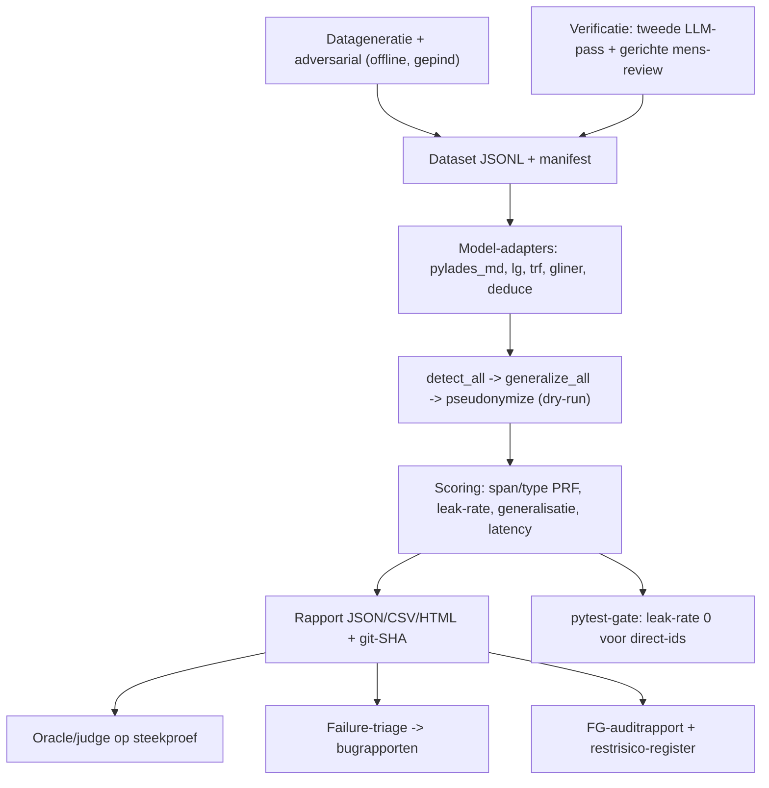

# Pylades testharnas — plan van aanpak

> Doelversie-scope: v0.3. Dit document beschrijft een her-uitvoerbaar testharnas
> voor de detectie-pijplijn van Pylades. Het is afgestemd op
> [PLAN.md](PLAN.md) en [SPEC-v0.3.md](SPEC-v0.3.md).

## 1. Doel

Een systematisch, **her-uitvoerbaar** testharnas dat draait op realistische
Nederlandse prompts plus gegenereerde, **span-level gelabelde** patiëntdossiers,
met vier doelen:

1. **Bugs** vinden in de detectie-pijplijn.
2. **Vals-positieve en vals-negatieve** identificatie per `EntityType`
   kwantificeren.
3. Het **optimale NER-model** en de **optimale laag-3 lokale LLM** kiezen
   (binnen de M1 8 GB-constraint).
4. **Auditbewijs** leveren voor de Functionaris Gegevensbescherming (FG/DPO).

De testautomatisering gebruikt een Anthropic-model (de upstream-provider die
Pylades al gebruikt) in vier rollen: datageneratie, adversariële cases,
beoordeling (oracle/judge) en failure-triage.

## 2. Scope

**In scope** — detectie-pijplijn-units:

- `detect_all()` in [proxy/detection.py](proxy/detection.py)
- `generalize_all()` in [proxy/generalization.py](proxy/generalization.py)
- `pseudonymize()` / `pseudonymize_dry_run()` in
  [proxy/pseudonymization.py](proxy/pseudonymization.py)

Het privacy-kritische artefact is de **gepseudonimiseerde prompt** ("wat het
externe LLM zou zien"), die vóór de upstream-call ontstaat. Daarom belt het
harnas Anthropic **niet** voor de meting.

**Buiten scope (deze ronde):** proxy end-to-end `/v1/messages`, Streamlit-UI,
en een aparte security-suite.

## 3. Architectuur van het harnas



## 4. Methodologische beslissingen

- **Twee meetniveaus gescheiden.** Ground truth staat op het **detectie**-niveau
  (origineel + type + offsets, vóór generalisatie). De generalisatie-transformaties
  (BR-B01..B05) worden apart geverifieerd als "verwachte output"
  (geboortedatum→jaar, PC6→PC2, leeftijd 90+, opnamedatum→maand-jaar).
- **Span-matching: beide rapporteren** — exacte offset-match én overlap/partial-match
  (correct type + overlappende span). Het verschil maakt randgevoeligheid zichtbaar.
- **Lek-definitie (hard).** Een lek = een origineel `DIRECT_IDENTIFIER`-substring
  dat **letterlijk** in de gepseudonimiseerde prompt overblijft. Gegeneraliseerde
  waarden (jaar, PC2) zijn per design géén lek.
- **spaCy-confidence is een vaste constante per label** (`_SPACY_LABEL_CONFIDENCE`
  in [proxy/detection.py](proxy/detection.py)); kalibratie-analyse geldt alleen
  voor modellen met echte scores (GLiNER/Presidio).
- **Bekende detector-gaten meten.** `ADDRESS` en `DIAGNOSIS` zitten in de
  `EntityType`-enum ([shared/models.py](shared/models.py)) maar hebben **geen
  detector**; het harnas meet en rapporteert deze als structurele false-negatives.
- **Label-mapping per extern model** (DEDUCE/GLiNER hebben eigen labels) is een
  expliciete adapter-laag én een gedocumenteerd meet-risico.

## 5. Ground-truth dataset

**Formaat** — JSONL, één record per dossier:

| veld | betekenis |
| --- | --- |
| `id` | unieke string |
| `seed` | generatie-seed (reproduceerbaar) |
| `scenario` | bv. `clinical_note`, `contact_details` |
| `difficulty` | `normal` of `adversarial` |
| `prompt` | volledige NL-dossiertekst |
| `entities` | lijst van `{start, end, text, type, category}` op detectie-niveau |
| `expected_generalization` | optioneel: origineel → verwachte gegeneraliseerde vorm |
| `meta` | herkomst, verificatie-status |

**Generatiepijplijn (gepind, seeded):**

1. Genereer dossier + gold-labels in één gestructureerde pass.
2. Self-check: verifieer offsets/typen tegen de tekst.
3. Automatische validators: BSN-elfproef en IBAN-mod-97 via
   [shared/crypto.py](shared/crypto.py), offset-alignment (`text[start:end] == text`),
   label-in-tekst; afkeuren bij fout.
4. Verificatie: tweede onafhankelijke LLM-pass, daarna gerichte mens-review op
   afwijkingen.

**Adversariële subset:** 9-cijferig niet-BSN, naam-lijkt-org en omgekeerd, datum
zonder contextwoord, near-threshold spaCy-namen, zeldzame vs veelvoorkomende
ICD-10, buitenlandse namen, typo's/OCR-ruis, hoge entity-dichtheid.

**Privacy:** 100% fictief; alle BSN's elfproef-geldig maar niet-bestaand;
expliciet vastgelegd voor de FG.

**Omvang:** gefaseerd ~150 (snel itereren) → ~600 (statistisch robuuster).

**Versiebeheer:** dataset onder `eval/datasets/<naam>/` met `manifest.json`
(versietag + sha256-checksum + seed + generator-info). De dataset wordt **gepind**
(niet per run hergegenereerd) om run-determinisme te garanderen.

## 6. Metrics

- Per `EntityType` en per categorie: precision / recall / F1, zowel **span-level**
  als **type-level** (beide matching-varianten).
- **Verwarringsmatrix** over `EntityType` (type-verwisselingen / vals-positieven).
- **Leak-rate** (primaire KPI): zie lek-definitie; **harde gate: 0** voor
  `DIRECT_IDENTIFIER`. `QUASI_IDENTIFIER`/`CLINICAL_SENSITIVE` worden gerapporteerd,
  niet geblokkeerd.
- **Over-redactie-rate**: niet-PII dat onnodig gepseudonimiseerd wordt.
- **Generalisatie-correctheid** (BR-B01..B05) als aparte check.
- Per model: **latency** p50/p95 + **piek-RAM** op M1 8 GB (één model tegelijk).
- **Confidence-kalibratie** waar van toepassing.

## 7. NER-modellen (top-5, op dezelfde dataset)

| Model | Type | Voordelen | Nadelen |
| --- | --- | --- | --- |
| spaCy `nl_core_news_md` (baseline) | CNN | licht, geïntegreerd | generieke labels; geen echte confidence |
| spaCy `nl_core_news_lg` | CNN | betere dekking, CPU/snel, drop-in | generieke labels |
| spaCy `nl_core_news_trf` | transformer | hoogste spaCy-accuratesse | zwaar (RAM/CPU); eval-time |
| GLiNER2-PII (multilingual) | zero-shot transformer | SOTA span-F1 op PII, 42 types incl. NL, configureerbaar, echte confidences, CoreML | lagere precisie OOD (overpredictie namen) |
| DEDUCE 3.0 (`vmenger/deduce`) | rule-based NL-medisch | transparant/auditeerbaar, NL-zorgcontext | mist nieuwe patronen; overlapt regex-laag |

Eervolle vermelding: Microsoft Presidio (NL via spaCy + recognizers + context-scoring)
als integratiepatroon dat het ontbrekende confidence-probleem oplost;
MedRoBERTa.nl vereist fine-tuning (geen out-of-the-box PII-detector).

## 8. Lokale LLM (laag 3)

Benchmark van laag-3 jargon/product/projectdetectie via Ollama (`detect_llm()` in
[proxy/detection.py](proxy/detection.py)): huidige `qwen3:1.7b` vs alternatieven
binnen 8 GB. De oracle-rol (volledige NER of upstream-vervanging) is expliciet
v1.0 en buiten scope.

## 9. Her-uitvoerbaarheid en projectstructuur

```
eval/
  datasets/      versie-gepinde JSONL + manifest (checksum, seed, generator-versie)
  generators/    datageneratie + adversarial + offline bootstrap
  runners/       model-adapters (pylades-pijplijn, later gliner/deduce/...)
  metrics/       scoring (span/type PRF, leak-rate, kalibratie, latency)
  judge/         oracle/judge (later)
  triage/        failure-clustering + bugrapport-concepten (later)
  reports/       JSON/CSV/HTML, getimestampt + git-SHA
  cli.py         python -m eval.cli run --dataset ... --report ...
tests/
  test_eval_scoring.py   unit-tests op de scoring-functies
  test_eval_gates.py     drempels (leak-rate 0 direct-ids)
```

- Eval-only dependencies als optionele groep `eval` in
  [pyproject.toml](pyproject.toml); runtime blijft `nl_core_news_md` ongewijzigd.
- CI: nieuw bestand onder `.github/workflows/` (nog niet aanwezig; alleen
  issue/PR-templates bestaan) dat gate + rapport draait.
- Reproduceerbaarheid: model-versies en dataset-checksum gepind; seeds vast;
  omgeving (python/spaCy/model-versies) in elk rapport.

## 10. FG/DPO-deliverable

- Auditrapport gekoppeld aan **BR-A..BR-G** met testbewijs per regel.
- Reproduceerbaar **lekkage-bewijs** (dataset-checksum + git-SHA).
- **Restrisico-register** met v0.3-beperkingen: plaintext
  `audit_log.original_prompt`, geen medisch NER, `ADDRESS`/`DIAGNOSIS` zonder
  detector, spaCy zonder per-entity-probabilities.
- **DPIA-input** als bijlage; volledige DPIA blijft FG-proces.

## 11. Fasering

| Fase | Inhoud |
| --- | --- |
| 0 | Dit document + label-schema + acceptatiedrempels |
| 1 | Dataset v1 (~150) genereren, valideren, pinnen |
| 2 | Scoring-engine + baseline-rapport (`md`) + pytest leak-gate |
| 3 | Adapters voor de 5 NER-kandidaten → vergelijkend rapport |
| 4 | Laag-3 lokale-LLM-benchmark |
| 5 | Oracle/judge + triage → bug-backlog; opschalen naar ~600 |
| 6 | FG-auditrapport + restrisico-register + CI-integratie |

## 12. Gekozen defaults

- Datasetomvang: gefaseerd 150 → 600.
- Privacy-gate: 0 lekken voor `DIRECT_IDENTIFIER`; quasi/clinical rapporteren.
- Eval-deps: GLiNER, DEDUCE, spaCy-trf (en evt. Presidio) als eval-only groep;
  runtime ongewijzigd.
- Verificatie: tweede onafhankelijke LLM-pass + gerichte mens-review.
- Span-matching: beide (exact + overlap).
