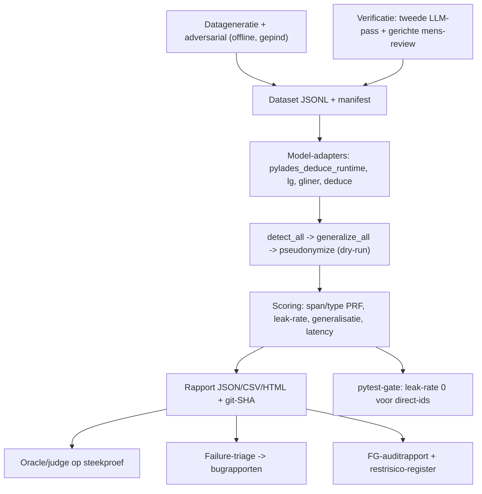

# Pylades testharnas — plan van aanpak

> Doelversie-scope: v0.3. Dit document beschrijft een her-uitvoerbaar testharnas
> voor de detectie-pijplijn van Pylades. Het is afgestemd op
> [PLAN.md](PLAN.md) en [SPEC-v0.3.md](SPEC-v0.3.md).

## 1. Doel

Een systematisch, **her-uitvoerbaar** testharnas dat draait op realistische
Nederlandse prompts plus gegenereerde, **span-level gelabelde** patiëntdossiers,
met vier doelen:

1. **Bugs** vinden in de detectie-pijplijn.
2. **Vals-positieve en vals-negatieve** identificatie per `EntityType`
   kwantificeren.
3. Het **optimale NER-model** en de **optimale laag-3 lokale LLM** kiezen
   (binnen de M1 8 GB-constraint).
4. **Auditbewijs** leveren voor de Functionaris Gegevensbescherming (FG/DPO).

De testautomatisering gebruikt een Anthropic-model (de upstream-provider die
Pylades al gebruikt) in vier rollen: datageneratie, adversariële cases,
beoordeling (oracle/judge) en failure-triage.

## 2. Scope

**In scope** — detectie-pijplijn-units:

- `detect_all()` in [proxy/detection.py](proxy/detection.py)
- `generalize_all()` in [proxy/generalization.py](proxy/generalization.py)
- `pseudonymize()` / `pseudonymize_dry_run()` in
  [proxy/pseudonymization.py](proxy/pseudonymization.py)

Het privacy-kritische artefact is de **gepseudonimiseerde prompt** ("wat het
externe LLM zou zien"), die vóór de upstream-call ontstaat. Daarom belt het
harnas Anthropic **niet** voor de meting.

**Buiten scope (deze ronde):** proxy end-to-end `/v1/messages`, Streamlit-UI,
en een aparte security-suite.

## 3. Architectuur van het harnas



Verificatie (mens/LLM), judge, triage en DPO-deliverables staan in §13 als open.
De pytest-gate zelf: formeel normal-subset; uitbreiding deduce/150 — §12.

## 4. Methodologische beslissingen

- **Twee meetniveaus gescheiden.** Ground truth staat op het **detectie**-niveau
  (origineel + type + offsets, vóór generalisatie). De generalisatie-transformaties
  (BR-B01..B05) worden apart geverifieerd als "verwachte output"
  (geboortedatum→jaar, PC6→PC2, leeftijd 90+, opnamedatum→maand-jaar).
- **Span-matching: beide rapporteren** — exacte offset-match én overlap/partial-match
  (correct type + overlappende span). Het verschil maakt randgevoeligheid zichtbaar.
- **Lek-definitie (hard).** Een lek = een `DIRECT_IDENTIFIER` waarvan de originele
  span **niet volledig (<100%) gedekt** wordt door detectie-spans (span-dekking,
  `find_exposed`/`_coverage_fraction` in
  [eval/metrics/scoring.py](eval/metrics/scoring.py)). Ook **gedeeltelijke**
  blootstelling telt mee. Een gedetecteerde span is volledig gedekt — of die nu
  one-way-gepseudonimiseerd óf gegeneraliseerd wordt (jaar, PC2) — en is dus géén
  lek; ook een span die met een *ander* type wordt gemaskeerd telt als gedekt (de
  type-fout zelf zit in de PRF/verwarringsmatrix, niet in de lek-KPI).
- **Laag-2-confidence (DEDUCE/spaCy-eval)** gebruikt vaste drempels per type
  (`Thresholds` in [proxy/detection.py](proxy/detection.py), env-keys
  `threshold_spacy_*`); kalibratie-analyse geldt alleen voor modellen met
  echte scores (GLiNER/Presidio).
- **Bekende detector-gaten meten.** `DIAGNOSIS` (vrije-tekstdiagnose) heeft
  **geen detector**; het harnas rapporteert blootstelling als structurele
  false-negative. `ADDRESS` heeft sinds v0.3 een **beperkte regex-laag**
  (NL-straat + huisnummer in [proxy/detection.py](proxy/detection.py)); complexe
  of afwijkende adresvormen blijven een bekend restrisico — meten en rapporteren
  blijft nodig.
- **Label-mapping per extern model** (DEDUCE/GLiNER hebben eigen labels) is een
  expliciete adapter-laag én een gedocumenteerd meet-risico.

## 5. Ground-truth dataset

**Formaat** — JSONL, één record per dossier:

| veld | betekenis |
| --- | --- |
| `id` | unieke string |
| `seed` | generatie-seed (reproduceerbaar) |
| `scenario` | bv. `clinical_note`, `contact_details` |
| `difficulty` | `normal` of `adversarial` |
| `prompt` | volledige NL-dossiertekst |
| `entities` | lijst van `{start, end, text, type, category}` op detectie-niveau |
| `expected_generalization` | optioneel: origineel → verwachte gegeneraliseerde vorm |
| `meta` | herkomst, verificatie-status |

**Generatiepijplijn (gepind, seeded):**

1. Genereer dossier + gold-labels in één gestructureerde pass.
2. Self-check: verifieer offsets/typen tegen de tekst.
3. Automatische validators: BSN-elfproef en IBAN-mod-97 via
   [shared/crypto.py](shared/crypto.py), offset-alignment (`text[start:end] == text`),
   label-in-tekst; afkeuren bij fout.
4. Verificatie: tweede onafhankelijke LLM-pass, daarna gerichte mens-review op
   afwijkingen. *(Stap 4 nog niet geautomatiseerd; zie §13.)*

**Adversariële subset:** 9-cijferig niet-BSN, naam-lijkt-org en omgekeerd, datum
zonder contextwoord, near-threshold laag-2-namen, zeldzame vs veelvoorkomende
ICD-10, buitenlandse namen, typo's/OCR-ruis, hoge entity-dichtheid.

**Privacy:** 100% fictief; alle BSN's elfproef-geldig maar niet-bestaand;
expliciet vastgelegd voor de FG.

**Omvang:** twee gepinde sets, samen ~600 — een **dev-set** van 150 dossiers
(`eval/datasets/synthetic/`, seed 1) voor snel itereren, en een **holdout-set**
van 450 dossiers (`eval/datasets/synthetic-holdout/`, seed 2) voor een
robuustere, niet-getunede meting. De pytest-gate (§12) draait op de dev-set;
de holdout is bewust niet gebruikt om drempels op te tunen.

**Versiebeheer:** datasets onder `eval/datasets/<naam>/` met een **manifest**
(versietag + sha256-checksum + seed + generator-info). Eén map kan meerdere
datasets bevatten; het harnas koppelt elke dataset aan het manifest waarvan het
`dataset_file`-veld overeenkomt (`resolve_manifest`), zodat bv. `dataset.jsonl`
en `dataset-10dossiers.jsonl` niet door elkaar lopen. De dataset wordt **gepind**
(niet per run hergegenereerd) om run-determinisme te garanderen.

## 6. Metrics

| Metric | Rapport | Gate (pytest) |
| --- | --- | --- |
| PRF per type (exact + overlap) | ✅ | — |
| Verwarringsmatrix | ✅ | — |
| Leak-rate `DIRECT_IDENTIFIER` | ✅ | ✅ (zie §12) |
| Exposure quasi/clinical | ✅ | — |
| Over-redactie (count) | ✅ | — |
| Latency p50/p95 + warm-up | ✅ | warm-up gedekt in gate-tests |
| Generalisatie BR-B01..B05 | ✅ | — (rapporteren) |
| Piek-RAM runtime | ❌ nog open | — |
| Confidence-kalibratie | ❌ nog open | — |

- **Leak-rate** (primaire KPI): zie lek-definitie; **harde gate: 0** voor
  `DIRECT_IDENTIFIER` op de normal-subset (§12). `QUASI_IDENTIFIER`/
  `CLINICAL_SENSITIVE` worden gerapporteerd, niet geblokkeerd.
- **Over-redactie-rate**: niet-PII dat onnodig gepseudonimiseerd wordt (geteld,
  nog geen drempel-gate).
- **Generalisatie-correctheid** (BR-B01..B05): `expected_generalization` wordt in
  `evaluate()` vergeleken met `generalize_all()` op de voorspellingen; zie
  `eval/metrics/generalization.py`.
- Per model: **latency** p50/p95 op M1 8 GB. De eerste runner-aanroep betaalt
  eenmalige **cold-start**-kosten (DEDUCE-init, spaCy-load bij `pylades_lg`, e.d.).
  `evaluate()` draait
  standaard eerst één **warm-up-aanroep**; die latency wordt weggegooid maar
  apart vermeld (`latency.warmup_ms`). `--no-warmup` meet de cold-start wél mee.
- **Piek-RAM** tijdens inferentie: nog te meten (nu alleen statische `memory_gb`
  van de host in het rapport).
- **Confidence-kalibratie** (GLiNER e.d.): nog te implementeren.

## 7. NER-modellen (top-5, op dezelfde dataset)

| Model | Type | Voordelen | Nadelen |
| --- | --- | --- | --- |
| DEDUCE 3.0 (`vmenger/deduce`) — **runtime baseline** | rule-based NL-medisch | transparant/auditeerbaar, NL-zorgcontext; geïntegreerd via `uv sync` | mist nieuwe patronen; overlapt regex-laag |
| spaCy `nl_core_news_lg` (eval-runner `pylades_lg`) | CNN | betere dekking generieke NER, CPU/snel | generieke labels; geen echte confidence |
| spaCy `nl_core_news_md` (eval-only) | CNN | licht | generieke labels; geen echte confidence |
| GLiNER multi-PII (`urchade/gliner_multi_pii-v1`) | zero-shot transformer | sterke span-F1 op PII, brede PII-typedekking (adapter beperkt tot NAME/ORG/LOCATION), echte confidences; **vult de transformer-rol** | lagere precisie OOD (overpredictie namen); zwaar (RAM) |

**Geen `nl_core_news_trf`.** Explosion publiceert voor Nederlands alleen
`sm`/`md`/`lg` ([spacy.io/models/nl](https://spacy.io/models/nl)); er is geen
officieel Dutch transformer-pipeline-pakket. `python -m spacy download
nl_core_news_trf` faalt daarom altijd. De transformer-benchmark in dit harnas
loopt via **GLiNER** (runner `pylades_gliner`), niet via een niet-bestaand
spaCy-trf-model.

Eervolle vermelding: Microsoft Presidio (NL via spaCy + recognizers + context-scoring)
als integratiepatroon dat het ontbrekende confidence-probleem oplost;
MedRoBERTa.nl vereist fine-tuning (geen out-of-the-box PII-detector).

**Implementatie (fase 3).** Elke NER-kandidaat is een laag-2-adapter
([eval/runners/ner_backends.py](eval/runners/ner_backends.py)) achter de
gemeenschappelijke `NerPipelineRunner`
([eval/runners/ner_pipeline.py](eval/runners/ner_pipeline.py)): dezelfde
regex-laag 1 + outbound-maskering, alleen het NER-model verschilt. Voor een
**eerlijke** vergelijking richten alle modellen zich op de spaCy-doeltypen
`NAME`/`ORG`/`LOCATION`; gestructureerde PII blijft van de deterministische
regex-laag, die bij overlap wint. De label-mapping per model (GLiNER-promptlabels,
DEDUCE-tags) is een expliciete, gedocumenteerde adapter-laag (§4). De zware
modellen (GLiNER, DEDUCE) zitten in de optionele `eval`-extra en
worden **lazy** geladen met een installatie-hint bij ontbreken. GLiNER laadt
met `max_length=768` (i.p.v. het model-default 384) zodat synthetische
dossiers niet worden afgekapt; langere teksten worden in overlappende chunks
verwerkt.

Runners (`--runner`): `pylades_deduce_runtime` (baseline), `pylades_lg`, `pylades_gliner`,
`pylades_deduce`. Eén dataset in één keer door alle modellen +
een vergelijkend rapport (CSV/HTML met PRF micro/macro, direct-leak-rate en
latency naast elkaar):

```
uv sync --extra eval
uv run python eval.py compare --dataset <set>
```

`nl_core_news_lg` zit in de eval-extra (naast GLiNER/DEDUCE); apart
`spacy download` is niet meer nodig. Voer `uv sync` uit vóór `compare` — anders
worden GLiNER/DEDUCE overgeslagen. Geen `#`-commentaar op dezelfde regel als
`uv sync` (uv interpreteert dat soms als pakketnaam).

Ontbrekende modellen worden in `compare` overgeslagen (met melding), zodat een
deelomgeving toch een rapport oplevert.

## 8. Lokale LLM (laag 3 — eval-only)

Laag 3 is **optioneel** en **standaard uit** in de runtime (`use_llm=False`).
Productie-NAME komt uit regex + DEDUCE + rol-heuristiek; dit hoofdstuk beschrijft
alleen het **eval-harnas** en experimentele backends.

Benchmark van laag-3 jargon/product/projectdetectie (en experimenteel NAME) via
Ollama (`detect_llm()` in [proxy/detection.py](proxy/detection.py)): huidige
`qwen3:1.7b` vs alternatieven binnen 8 GB. De oracle-rol (volledige NER of
upstream-vervanging) is expliciet v1.0 en buiten scope.

**Pluggable backend.** Laag 3 heeft een `Layer3Backend`-protocol; de runtime
gebruikt `OllamaBackend` (default), het harnas kan een alternatieve backend
injecteren via `detect_all(..., llm_backend=...)`. Zo vergelijken we dezelfde
pijplijn op verschillende inferentie-backends zonder runtime-gedrag te wijzigen.

**Ollama + MLX (Apple Silicon).** `OllamaMlxEvalBackend`
([eval/runners/ollama_mlx_backend.py](eval/runners/ollama_mlx_backend.py)) gebruikt
dezelfde `OllamaBackend`-pijplijn (`format="json"`) maar met een MLX-modeltag
(default `qwen3.5:2b-nvfp4`). Start Ollama met `OLLAMA_MLX=1`; zo vergelijken we
MLX-snelheid zonder de JSON-problemen van `mlx_lm.server`.

```
OLLAMA_MLX=1 ollama serve
ollama pull qwen3.5:2b-nvfp4
uv run python eval.py run --dataset <set> --runner pylades_md_ollama_mlx
```

**mlx_lm.server (Apple Silicon).** `MLXLayer3Backend`
([eval/runners/mlx_backend.py](eval/runners/mlx_backend.py)) praat met een lokale
OpenAI-compatibele MLX-server (`mlx_lm.server`). Hiermee draaien we hetzelfde
qwen3:1.7b op MLX (Apple Metal) i.p.v. Ollama (llama.cpp/GGUF) en meten we
detectie-kwaliteit (product/project P/R/F1) én latency naast elkaar.

Draaien:

```
# mlx-lm zit bewust niet in pyproject (alleen Apple Silicon); uv haalt het
# tijdelijk op met --with, dus niets globaal installeren. Gebruik `uv run`,
# want kaal `python` bestaat niet op macOS.
uv run --with mlx-lm python -m mlx_lm.server --model mlx-community/Qwen3-1.7B-4bit --port 8081
uv run python eval.py run --dataset <set> --runner pylades_md_mlx
```

Runners: `pylades_deduce_runtime` (regex+DEDUCE), `pylades_md_llm` (+ laag 3 via Ollama GGUF),
`pylades_md_ollama_mlx` (+ laag 3 via Ollama MLX, `OLLAMA_MLX_MODEL`),
`pylades_md_mlx` (+ laag 3 via `mlx_lm.server`). Endpoint/model: `OLLAMA_HOST`/
`OLLAMA_MLX_MODEL` of `MLX_HOST`/`MLX_MODEL`.

## 9. Her-uitvoerbaarheid en projectstructuur

```
eval/
  datasets/      versie-gepinde JSONL + manifest (checksum, seed, generator-versie)
  generators/    datageneratie + adversarial + offline bootstrap
  runners/       model-adapters (regex+DEDUCE runtime, spaCy lg, GLiNER, DEDUCE NerPipeline; laag-3-backends)
  metrics/       scoring (span/type PRF, leak-rate, kalibratie, latency)
  judge/         oracle/judge (later)
  triage/        failure-clustering + bugrapport-concepten (later)
  reports/       JSON/CSV/HTML, getimestampt + git-SHA
  compare.py     vergelijkend rapport over meerdere model-adapters
  cli.py         python -m eval.cli run|compare --dataset ... --report ...
tests/
  test_eval_scoring.py   unit-tests op de scoring-functies
  test_eval_gates.py     drempels (leak-rate 0 direct-ids; zie §12)
  test_eval_generalization.py  generalisatie-score (BR-B01..B05)
  test_eval_cli.py       CLI smoke
  test_eval_ner.py       NER-adapters
  test_eval_report.py    rapportage
  test_eval_mlx.py       laag-3 MLX-backend (optioneel)
  test_eval_ollama_mlx.py laag-3 Ollama+MLX (optioneel)
```

- Eval-only dependencies als optionele groep `eval` in
  [pyproject.toml](pyproject.toml); runtime laag 2 is DEDUCE (`deduce>=3.0.0`).
- CI: `.github/workflows/eval-gates.yml` draait pytest op gates, scoring,
  generalisatie en detectie-unit-tests.
- Reproduceerbaarheid: model-versies en dataset-checksum gepind; seeds vast;
  omgeving (python/DEDUCE/eval-model-versies) in elk rapport.

## 10. FG/DPO-deliverable

- Auditrapport gekoppeld aan **BR-A..BR-G** met testbewijs per regel.
- Reproduceerbaar **lekkage-bewijs** (dataset-checksum + git-SHA).
- **Restrisico-register** met v0.3-beperkingen: plaintext
  `audit_log.original_prompt`, geen medisch NER, `DIAGNOSIS` zonder detector,
  beperkte `ADDRESS`-regex (niet alle adresvormen), laag 2 zonder
  per-entity-probabilities (DEDUCE/spaCy-eval).
- **DPIA-input** als bijlage; volledige DPIA blijft FG-proces.

## 11. Fasering

| Fase | Inhoud | Status (jun 2026) |
| --- | --- | --- |
| 0 | Dit document + label-schema + acceptatiedrempels | ✅ af |
| 1 | Dataset v1 (~150) genereren, valideren, pinnen | ✅ af (`eval/datasets/synthetic/`) |
| 1b | Holdout-set (450) genereren, valideren, pinnen | ✅ af (`eval/datasets/synthetic-holdout/`) |
| 2 | Scoring-engine + baseline-rapport (`md`) + pytest leak-gate | ✅ af |
| 3 | Adapters NER (md/lg/GLiNER/DEDUCE) → vergelijkend rapport | ✅ af |
| 4 | Laag-3 lokale-LLM-benchmark | 🟡 backends + runners; systematische benchmark open |
| 5 | Oracle/judge + triage → bug-backlog; opschalen naar ~600 | 🟡 holdout-set (450, `synthetic-holdout`) gepind → ~600 totaal; judge/triage open |
| 6 | FG-auditrapport + restrisico-register + CI-integratie | 🟡 CI-gates af; FG-deliverables open |

## 12. Gekozen defaults

- Datasetomvang: 150 dev-set (`synthetic`) + 450 holdout (`synthetic-holdout`)
  gepind, ~600 totaal. De gate draait op de dev-set; de holdout is held-out.
- **Privacy-gate (formeel):** 0 lekken voor `DIRECT_IDENTIFIER` op de
  **normal-subset** (`difficulty == "normal"`); adversarial alleen rapporteren
  in vergelijkingsrapporten.
- **Privacy-gate (pytest, uitbreiding):** naast de formele gate draait
  [tests/test_eval_gates.py](tests/test_eval_gates.py) strengere regressie:
  - bootstrap normal-subset via `PyladesPipelineRunner()` (DEDUCE runtime);
  - gepinde normal-records `syn_029`, `syn_060` op `pylades_deduce`;
  - gepinde adversarial-records `syn_112`, `syn_120`, `syn_121`, `syn_122`,
    `syn_140` op `pylades_deduce` **zonder GLiNER** (`name_fallback=False`);
  - volledige synthetische set (150 dossiers) 0 direct-lek op diezelfde
    deduce-pijplijn. Dit is een **productie-gerichte regressie**, geen vervanging
    van de formele gate op alleen-normal.
- Quasi/clinical: rapporteren, niet blokkeren.
- Eval-deps: GLiNER, DEDUCE als eval-only groep; runtime ongewijzigd.
  GLiNER blijft optioneel (`name_fallback=True`) voor vergelijking, niet default.
- Verificatie: tweede onafhankelijke LLM-pass + gerichte mens-review (nog open).
- Span-matching: beide (exact + overlap).

## 13. Implementatiestatus

Laatste update: juni 2026. Dit hoofdstuk volgt de voortgang t.o.v. §1–§12.

### Afgerond

- CLI: `eval.py` (`bootstrap`, `generate`, `validate`, `run`, `compare`, `runners`).
- Gepinde datasets: bootstrap (10), synthetic (150, dev-set),
  synthetic-holdout (450), elk met manifest + sha256.
- Scoring, rapporten (JSON/CSV/HTML), vergelijkend rapport, warm-up-latency.
- NER-runners: `pylades_deduce_runtime`, `pylades_lg`, `pylades_gliner`, `pylades_deduce`.
- DEDUCE-pijplijn: rol-context-heuristiek ([proxy/role_names.py](proxy/role_names.py)),
  NAME-span-uitbreiding ([proxy/name_spans.py](proxy/name_spans.py)), optionele
  GLiNER-fallback uit in default.
- Laag-3 eval-backends: Ollama GGUF, Ollama+MLX, `mlx_lm.server`.
- Pytest: scoring, gates, CLI, rapport, NER (plus optionele laag-3-tests).

### Nog open (prioriteit)

1. ~~**Generalisatie-score**~~ — af (`eval/metrics/generalization.py`).
2. ~~**Dataset ~600 genereren/valideren/pinnen**~~ — af (holdout 450,
   `synthetic-holdout`); **opnieuw triageren** op de holdout blijft open.
3. **`eval/judge/`** — oracle/judge op steekproef (§3).
4. **`eval/triage/`** — failure-clustering → bugrapporten (§3).
5. **Verificatie-pijplijn** — tweede LLM-pass + mens-review (§5 stap 4).
6. **Laag-3 benchmark** — systematische vergelijking modellen binnen 8 GB (fase 4).
7. **Metrics** — piek-RAM runtime, confidence-kalibratie (§6).
8. **FG/DPO** — auditrapport BR-A..BR-G, restrisico-register, DPIA-input (§10).
9. ~~**CI**~~ — af (`.github/workflows/eval-gates.yml`).

### Detectie-verbeteringen buiten het harnas (productie)

Deze vallen onder de detectie-pijplijn (§2) en verbeteren deduce-leak-KPI's;
ze staan niet als aparte TESTPLAN-fase:

- ADDRESS-regex (NL straat + huisnummer) in regex-laag 1.
- Rol-context NAME-heuristiek en span-coalescence in de deduce-eval-adapter.
- Rol-context NAME-heuristiek in runtime `detect_all()` ([proxy/detection.py](proxy/detection.py)).
